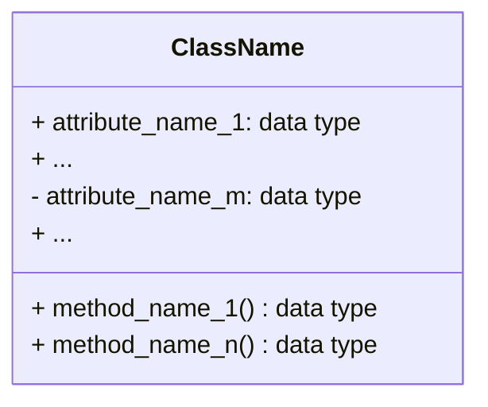
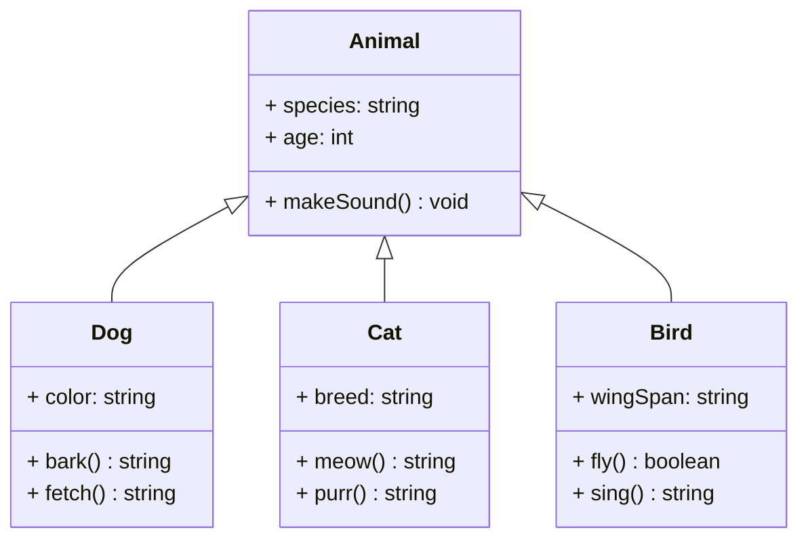

**Acknowledgement:** This post is based mainly on Dr. Quang Vinh Nguyen's presentation and slides and partly on on TA, STA, and peers' responses from the course AIO2025 offered by AI VIETNAM.

**Relevance:** The audience of this lecture were those who have read [Python for AI 104](), had some coding experience, and known a bit of AI knowledge. Absolute beginners are encouraged to read the material and repeatedly practice coding without AI assistance to strengthen their coding and code-reading skills. Note that only necessary Python knowledge is introduced here.

In today's post, we'll explore classes and objects in Object-Oriented Programming. We'll also discuss some applications in AI including using PyTorch. We aim to be able to read and explain the usage of classes in Pytorch later on.

<hr>

## **Introduction to OOP**
Like other parts of programming, **Object-Oriented Programming (OOP)** is developed to tackle real-world problems by organizing code into structures that mirror real-life situations.

### **Why OOP?** 
Previously, we learned about built-in data structures like integer, string, list, and dictionary. However, they can barely handle complicated reality which requires solutions to be customized concept by concept and even case by case. *Classes* and *objects* are to address this need. A **class** can be considered a user-defined data type.

:question: It may seem functions can handle complex situations just fine. **Why else do we need classes and objects? How are they better than functions?** 

Let's say you want to learn how to cook. There are at two ways to go about this.
- The first is to use some available recipe for a specific dish. If you wish to change an ingredient or exclude a spice, you have to ensure your food would still keep the adequate taste and texture. It might be easy to do so for one meal, but imagine doing it every day, it would be a pain in the neck. This can be associated with *procedural programming*.
- On the other hand, you can learn first three or four fundamental cooking techniques, basic ingredients, seasonings, and measurements, you'd be able to create your own recipes. Moreover, you can practice others' recipes and modify it as much as you like. This can be associated with *OOP*. 

The table below compares *key* aspects between two types of programming.
<table class = 'language-python'>
    <tr>
        <th>Aspect</th>
        <th>Procedural Programming</th>
        <th>Object-Oriented Programming</th>
    </tr>
    <tr>
        <th scope='row'>Approach</th>
        <td>
            Top-down:
            <ul>
                <li> Break down a complex problem into smaller and more manageable ones and solve them sequentially with specific instructions. </li>
            </ul>
        </td>
        <td>
            Bottom-up:
            <ul>
                <li> Define individual components and assemble them into an intricate system that can solve complex problems of the same type. </li>
            </ul>
        </td>
    </tr>
    <tr>
        <th scope='row'>Security</th>
        <td>
            Not secure:
            <ul>
                <li> Data is separate from functions and can be accessed and modified by any function. </li>
            </ul>
        </td>
        <td>
            Secure:
            <ul>
                <li> Data and related functions are encapsulated in one container called a class. Data in one class cannot be manipulated by an outsider without permission. </li>
            </ul>
        </td>
    </tr>
    <tr>
        <th scope='row'>Maintenance</th>
        <td>
            Challenging to maintain:
            <ul>
                <li> Functions and data are tightly related but built separate from each other. Any change in a data structure leads to the need to update the functions operate on it. </li>
            </ul>
        </td>
        <td>
            Easy to maintain:
            <ul>
                <li> Data and functions are in one place. Data structures can be modified without affecting functions operating on them or any outsider. </li>
            </ul>
        </td>
    </tr>
    <tr>
        <th scope='row'>Reusability</th>
        <td>
            Limited:
            <ul>
                <li> Each function operates on a specific data structure list, which results in code duplication (rewriting on different data structures) or potential errors (modifying the existing code) if different data types are passed through. </li>
                <li> Functions do not at all bind each other. </li>
            </ul>
        </td>
        <td>
            Highly reusable:
            <ul>
                <li> Different objects can be created from the same class if they share data and functions. </li>
                <li> The relationship among classes are allowed and flexible. </li>
            </ul>
        </td>
    </tr>
    <tr>
        <th scope='row'>Implementation</th>
        <td>
            Straighforward logic but harder in large projects:
            <ul>
                <li> It is organized as a sequence of steps to be followed. </li>
                <li> Modification in one block may bring about that in others. </li>
            </ul>
        </td>
        <td>
            Straighforward logic and easier with more complex projects:
            <ul>
                <li> It is organized as building blocks to be assembled. </li>
                <li> Modification in one block has no impact on the rest. </li>
            </ul>
        </td>
    </tr>
</table>

<br>

<hr>

## **Classes and Objects** {#class-object}
We'll first look at some real-world examples. You can think of your own examples based on these if that helps you understand the concepts better.

- *Example 1:* We above talked about cooking techniques like boiling, simmering, and roasting. In this context, "CookingTechique" can be seen as a class while boiling, simmering, and roasting are specific objects within that class. 
- *Example 2:* An apartment complex usually has an architect team make a blueprint drawing and uses it as a guide for construction. A blueprint serves a class and apartments are objects of that class. 
- *Example 3:* Fruit is a plant's seed-containing product such as an apple, banana, or orange. Here, "Fruit" is a class with apples, bananas, and oranges as its objects.
- *Example 4:* Animal can be considered a class in the context of a pet shop where cats, dogs, and birds are part of it. They are called objects of the class "Animal".
- *Example 5:* When mentioning a cat store, we can actually identify "Cat" as a class since there are different types of cat breeds like Bambino, Korat, Sphynx, and York Chocolate. Each of them is an object in this class.

### **Definitions and Terminology** 
Now let's lay down the actual definitions:
1. A **class** is a user-defined template.
2. An **object** is an instance of a class. 
3. A class **attribute** (a.k.a. property) is a variable that is shared among all *instances* of a class.
4. A class **method** is a function that operates on a class itself.  

Essentially, a *class* is an *enclosed* generalization of many objects. What can be a class and what can be an object depends on the context. There is no fixed solution for this matter. 

*Attributes* refers to properties of a class and are just variables since a class is like a template or an outline. Take the class "Cat" in example 3, "hair" can be its property and for each of its objects, either no hair, short hair, or long hair would be specified. 

*Methods* refers to behaviors or actions of a class. The class "Animal" can have walk, sit, sleep, and eat as methods and any object of its would have them.

**Name Convention** 

| Terminology | Name Convention       |
|:-----------:|:---------------------:|
| Class       | CamelCase             |
| Object      | snake_case            |
| Attribute   | snake_case and a noun |
| Method      | snake_case and a verb |

<br>
The way these terms are named can be slightly modified depending on their positions and purposes in the program. We'll talk more  in a later section of this post. 

### **Class Diagram and Encapsulation**
Before putting the ideas into writing, it's imperative you convey them clearly to yourself and/or your collaborators. In terms of OOP, one standard step is to represent the structure of a class using a **class diagram** rather than a regular drawing. 

A class diagram is like a house with one roof and two stories. The class name stays in the roof; its attributes stay on the second floor; its methods stay at ground level. 

Each attribute and method should be displayed with three parts from left to right:
- **access modifiers**
- **attribute name / method name**
- **(returned) data type:** *void* if there's none.


<figcaption style='text-align: center; width: 100%; font-size: 0.875em; margin-top:-5px; margin-bottom:15px;'>
    <em>Figure 1.</em> Class diagram template
</figcaption>

:question: You may wonder, **What are access modifiers?**

Great question! Earlier, we said a class is like an enclosed container. Take ChatGPT for example. Its free version with limited features is open to the public and plus subscribers are exposed to more but not all while pro members have access to the latest release. 

We'll put down some new terms in a moment. You can skim over this part to get yourself familiar with them and come back later when they are carefully mentioned.

| Name          | Class Diagram | Code                                             | Description                                     |  
|:-------------:|:-------------:|:------------------------------------------------:|:-----------------------------------------------:|
| **Public**    | $+$           | nothing added to name                            | can be used by any outsider                     |
| **Protected** | $-$           | single-underscore `_` attached to the beginning  | can only be used by that class and its children |
| **Private**   | #             | double-underscore `__` attached to the beginning | can only be used by that class                  |

<br>
An outsider can use protected variables, but it's best practice not to do so. 

### **Implementation**

```python
# create a class
class ClassName:
    def __init__(self, attribute_parameter_1, ..., attribute_parameter_n):
        self.attribute_name_1 = attribute_parameter_1
        ...
        self.attribute_name_n = attribute_parameter_n
    
    def method_name_1(self, parameter_1, ..., parameter_n):
        # function body

    ...

    def method_name_k(self, parameter_1, ..., parameter_n):
        # fuction body
```

```python
# create an object
object_name = ClassName(attribute_argument_1, ..., attribute_argument_n):

# access an attribute if allowed
object_name.attribute_name_k

# call a method if allowed
object_name.method_name_k(argument_1, ..., argument_n)
```

- The **constructor** `__init__()` is to *initialize attributes* whenever an object is made. It's conventional to use this special method, but creating a class without it or placing attributes in a regular method is acceptable. Assigning an object is a bit different in these two cases. Take a look below.

```python
class Cat:
    def __init__(self, input_name, input_age):
        self.name = input_name
        self.age = input_age

# test
a_cat = Cat('Bruce', 2.2)
print(a_cat.name, a_cat.age) 

'''
Bruce 2.2
'''
```

```python
class Cat:
    name = 'unknown'
    age = -1

    def set_init_value(self, input_name, input_age):
        self.name = input_name
        self.age = input_age

# test
a_cat = Cat()
print(a_cat.name, a_cat.age)
a_cat.set_init_value('Bruce', 2.2)
print(a_cat.name, a_cat.age)

'''
unknown -1
Bruce 2.2
'''
```

- The **special parameter** `self` is *mandatorily* included first thing when a method is defined. It is *not* a keyword, just adopted in Python by convention, and can be replaced by any word (except a keyword). To understand what it does, think about visiting someone's house, you'd need to ask the owner if you can come in and if you can touch/use an item. `self` is the owner, refering to the class or object carrying it. We can *access* attributes and methods through `self` using a dot `.` just like regular methods in previous posts.

- An attribute is allowed to have the *same* name as its parameter to avoid wasting resources, but it's important to distinguish them when reading or writing code. 

Let's update the Cat class example.

```python
class Cat:
    def __init__(self, name, age):  # constructor
        self.name = name            # assign values to an attribute
        self.age = age
    
    def increase_age(self, age):
        self.age = self.age + age

    def describe(self):
        print(f'Name: {self.name} - Age: {self.age}')

    def __call__(self, nick_name):
        print(f'I call him {nick_name}.')

# test
a_cat = Cat('Bruce', 2.2)
a_cat.describe()

a_cat.increase_age(0.5)
a_cat.describe()

a_cat('Brucy')

'''
Name: Bruce - Age: 2.2
Name: Bruce - Age: 2.7
I call him Brucy.
'''
```

- The **built-in method** `__call__()` enables an *object* to be called like a function, that is, `object_name(argument_1, ..., argument_n)` as shown in this example. 

:question: We briefly mentioned access modifiers and how to use them above. You might have wondered, **What if an outsider wants to use either a proctected or private attribute?**

*Attributes* are often set **private**, so only its class can employ them. To handle this issue, you can write two methods for each attribute: 
- the **getter** is to touch and read the attribute
- the **setter** is to assign it a value. 

These two methods allows you to *read* a private attribute and *modify* it as desired without making any error.

```python
class Cat:
    def __init__(self, name):
        self.__name = name     
    
    def __call__(self):
        print(f'Name: {self.__name}.')

    def get_name(self):     # getter
        return self.__name

    def set_name(self, name):     # setter
        self.__name = name

# test
a_cat = Cat('Bruce')
a_cat()

print(f'Getter: {a_cat.get_name()}.')
a_cat.set_name('Brucy')
a_cat()

print(a_cat.__name)

'''
Name: Bruce.
Getter: Bruce.
Name: Brucy.
AttributeError
'''
```

<hr>

## **Delegation**
We implied previously that a class is defined to be a data type like string, integer, or list. Logically, we should be able to use it as one. The **delegation** characteristics lets us do so. 

- *Example 1:* If you know a function's operations in math, you can think of delegation as a composition. That is, the composition of $f(x)$ and $g(x)$ is 
$$f \circ g(x) = f(g(x))$$
where $g(x)$ replaces and acts as $x$ in $f(x)$. 

- *Example 2:* Think of is a manager and their secretary's jobs. The manager usually knows his busisness as a whole while the secretary is responsible for some detailed work given by the manager. 

- *Example 3:* Every person has their own date of birth which comprises day, month, and year. But, a date appears in many other contexts; it's more convenient to have it stand alone and serve as a supporting component for others. 

Using example 3, let's write classes so they have a method that can check if two people have the same date of birth.

```python
class Date:
    def __init__(self, month, day, year):
        self.__month = month
        self.__day = day
        self.__year = year

    def get_month(self):
        return self.__month

    def get_day(self):
        return self.__day

    def get_year(self):
        return self.__year

    def describe(self):
        print(f'DOB: {self.get_month()} - {self.get_day()} - {self.get_year()}')

    def check_same_date(self, a_date):
        return self.__year == a_date.__year and self.__month == a_date.__month and self.__day == a_date.__day

class Person:
    def __init__(self, name, date_of_birth):
        self.__name = name
        self.__date_of_birth = date_of_birth

    def describe(self):
        print(f'Name: {self.__name}')
        self.__date_of_birth.describe()
    
    def check_same_dob(self, a_person):
        return self.__date_of_birth.check_same_date(a_person.__date_of_birth)

# test
joey_dob = Date(1, 9, 1968)
joey = Person('Joey', joey_dob)
joey.describe()

phoebe_dob = Date(2, 16, 1967)
phoebe = Person('Phoebe', phoebe_dob)
phoebe.describe()

ursula_dob = Date(2, 16, 1967)
ursula = Person('Ursula', ursula_dob)
ursula.describe()

print(f'Phoebe and Ursula twins: {phoebe_dob.check_same_date(ursula_dob)}.')
print('Joey and Phoebe have the same date of birth.' if joey.check_same_dob(phoebe) else 'Joey and Phoebe have different dates of birth.')

'''
Name: Joey
DOB: 1 - 9 - 1968
Name: Phoebe
DOB: 2 - 16 - 1967
Name: Ursula
DOB: 2 - 16 - 1967
Phoebe and Ursula twins: True
Joey and Phoebe have different dates of birth.
'''
```

<details class = 'bordered-block'>
    <summary>
        <strong>Practice Exercises</strong>
    </summary>
    <div class = 'bordered-inner-block language-python'>
        <strong>Exercise 1:</strong> Draw a class diagram for the example code above.  
        <br>
        <strong>Exercise 2:</strong> Write <code>describe()</code> method in the Person class. Which way do you think is clearer? Explain why or why not.
        <br>
        <strong>Exercise 3:</strong> Write a method to check if two people have the same name.  
        <br>
        <strong>Exercise 4:</strong> Write a method to check if two people are the same age given a specific date inputed from users. 
    </div>
</details>
<br>

<hr>

## **Inheritance**

```python
class ParentClassName:
    def __init__(self, parent_att_1, ..., parent_att_n):
        # assignment
    
    # other methods

class ChildClassName(ParentClassName):  # inherit regular methods from its parent class
    def __init__(self, parent_att_1, ..., parent_att_n, child_att_1, ..., child_att_m):
        # inherit its parent class' attributes
        super().__init__(parent_att_1, ..., parent_att_n)
        self.child_att_1 = child_att_1
        ...
        self.child_att_m = child_att_m
    
    # other methods that are not the same as their parent class'
```

A *child class* **inherits** their *parent class*' regular methods via `ChildClassName(ParentClassName)`. A child needs `super().__init__(parent_att_1, ..., parent_att_n)` to inherit the attributes *particularly* when it has their own other attributes.

In a real-world family, children may inherit assets from their parents, some but not all. This concept is adopted quite closely in programming. Python allows most properties and methods of one class' to be contained in another. 
- The *former* class is called a **super**, **base** or **parent class**.
- The *latter* is called a **derived**, **extended**, or **child class**. 

In a class diagram, this relationship is represented by an *arrow with a hollow head from the child to parent class*. It can be interpreted that information in a parent class also belongs to their child class. Take examples 4 and 5 at the beginning of Section [Classes and Objects](#class-object), Animal can be the parent class while Cat is its child class.


<figcaption style='text-align: center; width: 100%; font-size: 0.875em; margin-top:-5px; margin-bottom:15px;'>
    <em>Figure 2.</em> Class diagram for inheritance
</figcaption>

### **Reusability** 
Since a child class shares most properties and methods of their parent class, they can use those as their own; they are either public or protected. However, a child class *cannot* use private ones, for example, children are not allowed to read anyone's diary including their parents'. That's theory, but in practice, child classes can access private attributes or methods via *getter*.

A child class *must* use `self.parent_att_n` to gain access to their parent class' non-private properties. Yet, `super().parent_met_n` or `self.parent_met_n` can both be used to employ the parent class' methods. 

Let's take a look below where each employee has a name because they are people and in addition, they have their own salary. 

```python
class Person:
    def __init__(self, name):
        self._name = name

    def describe(self):
        print(f'Name: {self._name}')

class Employee(Person):
    def __init__(self, name, salary):
        super().__init__(name)
        self.__salary = salary

    def emp_describe(self):
        print(f'Name using attribute: {self._name}')
        super().describe()

# test
rachel = Employee('Rachel', 60000)
rachel.emp_describe()

'''
Name using attribute: Rachel
Name: Rachel
'''
```  

If `super().__init__()` is replaced by `ParentClassName.__init__(self)`, there *must* be a `self` as a parameter so that the program knows which parent class the child class takes initiations from.

<details class = 'bordered-block'>
    <summary>
        <strong>Practice Exercises</strong>
    </summary>
    <div class = 'bordered-inner-block language-python'>
        <strong>Exercise 1:</strong> Can <code>self.describe()</code> replace <code>super().describe()</code> in the example? Explain why or why not.
        <br>
        <strong>Exercise 2:</strong> Write two classes where one uses the other as a subclass:
        <ol>
            <li> compute factorial of a number. </li>
            <li> estimate the Euler number. </li>
        </ol>
        <strong>Hints:</strong> 
        <ul> 
            <li> Which one is the child class? Does it need <code>super()</code>? </li>
            <li> $$e \approx 1 + \frac{1}{1!} + \frac{1}{2!} + \cdot + \frac{1}{n!}$$ </li>
        </ul>
    </div>
</details>
<br>

### **Polymorphism or Overriding**
Now, a manager is also an employee of a company, but their salary is for sure different from other workers.

```python
class Employee:
    def __init__(self, name, salary):
        self._name = name
        self._salary = salary

    def compute_salary(self):
        return self._salary

    def salary_announcement(self):
        print(f'{self._name} gets paid ${self.compute_salary()} per year.')

class Manager(Employee):
    def __init__(self, name, salary, bonus):
        super().__init__(name, salary)
        self.__bonus = bonus

    def compute_salary(self):
        return super().compute_salary() + self.__bonus

# test
rachel = Manager('Rachel', 60000, 5000)
tag = Employee('Tag', 40000)
rachel.salary_announcement()
tag.salary_announcement()

'''
Rachel gets paid $65000 per year.
Tag gets paid $40000 per year.
'''
```

<details class = 'bordered-block'>
    <summary>
        <strong>Practice Exercises</strong>
    </summary>
    <div class = 'bordered-inner-block language-python'>
        Modify the example above so that the program also displays their positions, for example, "Tag is a worker and gets paid $40000 per year".
    </div>
</details>
<br>

### **Abstraction or As a Template**
Think of the "Animal" class, most of them make sounds but theirs are different from each other. So we want that class to have a sound method but each child class to have their own as well. 

To do so, we need to install *packages* named `ABC` and `abstractmethod`. We also indicate these modules' usage via `ParentClassName(ABC)` and `@abstractmethod` right above the shared method and inside the method is `pass`. With this syntax, the parent class passes the shared method to its child classes so they can use it in their own way.

```python
# install important packages
from abc import ABC, abstractmethod

class Animal(ABC):
    @abstractmethod
    def make_sound():
        pass

class Cat(Animal):
    def __init__(self, sound):
        self.__sound = sound

    def make_sound(self):
        print(f'A cat says {self.__sound}')

class Dog(Animal):
    def __init__(self, sound):
        self.__sound = sound

    def make_sound(self):
        print(f'A dog says {self.__sound}')

class Rabbit(Animal):
    def make_sound(self):
        pass

# test 
a_cat = Cat('meow')
a_dog = Dog('wolf')
a_rabbit = Rabbit()

a_cat.make_sound()
a_dog.make_sound()
a_rabbit

'''
A cat says meow
A dog says wolf
<__main__.Rabbit at 0x7c8d8949d390>
'''
```

<details class = 'bordered-block'>
    <summary>
        <strong>Practice Exercises</strong>
    </summary>
    <div class = 'bordered-inner-block language-python'>
        Write one parent class called "Shape" and three child classes for a circle, rectangle, and square. They each have one method to compute the area and perimeter of those shapes.
    </div>
</details>
<br>

## :bulb: **Application in AI**
All we've discussed up to this point is to understand how to use **Pytorch** and **custom class in Pytorch**, particularly **ReLU layer**.

```python
# install Pytorch package
import torch 
import torch.nn as nn
 
# create a ReLU function using torch
# Module is the parent class coming from nn
class MyReluActivation(nn.Module):
    def __init__(self):
        super().__init__()

    # forward is a built-in function in nn.Module
    def forward(self, x):
        # clamp function is a piece-wise function
        # f(x) = x if x > min else 0
        return torch.clamp(x, min = 0)


# Tensor is to work with a multi-dimensional array
data = torch.Tensor([3, 7, -5])
print(f'Data is {data}.')

# test
my_relu = MyReluActivation()
output = my_relu.forward(data)  # my_relu(data) is accepted
print(f'Output of ReLU function is {output}.')

'''
Data is tensor([ 3.,  7., -5.]).
Output of ReLU function is tensor([3., 7., 0.]).
'''
```

<hr>

## :speech_balloon: **FAQ**
Here are some good questions asked during class. The answers to these questions came from either some admin, TA, STA, or members of AIO2025.

| Questions | Answers |
|-----------|---------|
| Class diagram overview | <https://www.uml-diagrams.org/class-diagrams-overview.html> |
| What are special methods like `__call__` called? | It's Dunder method. |
| If there are 2 special methods in a class, how do we call so that they are specified? | `object_name.__method_name__` |
| Can there be multiple constructors in a class? | It's called [overloading constructor](https://dnmtechs.com/exploring-overloading-the-__init__-method-in-python-3-handling-different-argument-types/#:~:text=the%20arguments%20passed.-,Overloading%20the%20__init__%20Method,-To%20overload%20the). Typically it should be avoided, but ther are two ways to go about this situation. One of them is to use `decorator @classmethod`. |
| Can an attribute parameter have a default value? | Yes. |
| Is there a way to create getter and setter for multiple attributes? | Yes. Check out `__init__(self, **kwargs)` and `set_attrs(selfm **attrs)`. |

<br>

#### Check List

- [x] Exercise 1 (date)
- [ ] Exercise 2 (date)
  - [x] Put on left sock
  - [ ] Put on right sock
- [x] Go to school
