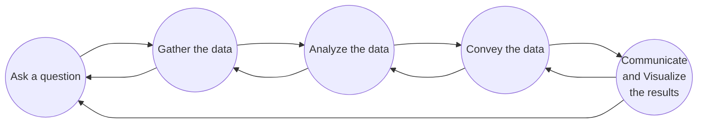

**Acknowledgement:** This post is based mainly on Vinh Dinh Nguyen's presentation and slides and partly on on TA, STA, and peers' responses from the course AIO2025 offered by AI VIETNAM.

**Relevance:** The audience of this lecture were those who have read [Data Visualization and Analysis for AI 101](), had some coding experience, and known a bit of AI knowledge. 

Visualizing data *properly* plays a significant role in learning how data is distributed and related before we delve into complex data analysis. In today's post, we'll explore common types of charts used in data visualization and more importantly, how to choose the right one for our dataset in general. We'll look at real-world examples and case studies to see how different chart types work in action, giving more hands-on feel for the process.

<hr>

## **Data Visualization**
**Data visualization** is the process of transforming image, number, sound, or text information into visual elements like maps or graphs. In this way, we, as human users, can approach, comprehend, and identify *insights* from the information as a whole better and more easily.

If we have thousands and thousands of lines of values, it'd be extremely challenging to look at them and draw a conclusion. A chart made out of such a dataset can be much easier on the eye, not only for data experts but also regular people. For example, we wouldn't know how president candidates are doing nationwide by just looking at numbers because of how Electoral College works.

Data visualization can be used on a wide range of data and take on various forms including 2Ds and 3Ds. Good data visualization helps lay the groundwork for further analysis like data mining, which ultimately supports smarter decision-making. There are different packages that we can use to visualize a dataset. In this post, we'll focus on using three main ones:
- **matplotlib:** it is a quite complete visualization tool, offering extensive customization but requires a lot of parameters passed to a function, so users need to understand them more clearly.
```python
import matplotlib.pyplot as plt
```
- **seaborn:** it simplifies statiscal plots with built-in themes, focusing more on data itself rather than its meaning but makes it harder to customize the output.
```python
import seaborn as sns
```
- **plotly:** it provides dynamic and interactive visualization which users can engage with charts and see details without complicating charts.
```python 
import plotly.express as px
```

It takes skill and experience to create a effective visualization. At its core, it all starts with the fundamental process. The figure below displays the full data science cycle---how visualization fits into the bigger picture.


<figcaption style='text-align: center; width: 100%; font-size: 0.875em; margin-top:-5px; margin-bottom:15px;'>
    <em>Figure 1.</em> Data Science Process
</figcaption>

:pushpin: **Pro tip:** Learning how to use libraries to visualize datasets is a small step in the big picture. Beginners should focus on building and sharpening critical thinking and analysis mindset to understand data and determine what charts to apply and how to use them.

<hr>

## **Choose the Right Chart Type**
There are *five fundamental steps* to go through when it comes to choosing the right chart type. Practically, we need to modify this process to be suitable for our datasets.

### **Determine the Type of Data** 
Data can be categorized into four following types with the first three being commonly encountered.
- **Quantitative data:** numerical values.
- **Categorical data:** non-numerical values, for example, text.
- **Temporal data:** numerical and time-series values.
- **Spatial data:** location-based values.

### **Identify the Relationship between Variables**
A dataset can have hundreds of variables/properties which are stored in columns. When working with a dataset, we need to understand its properties and know which ones are valuable to problems raised. That is, we have to learn how they are linked with each other within the dataset. As such, we can narrow down the kinds of charts we should use to magnify their relationship.

There are four primary types of charts that corresponds to connection between variables.
- **Comparison chart** 
    - used for showing differences 
        - among multiple data 
        - over time (to indicate trend)
    - a bar chart, column, or line chart.
- **Distribution chart**
    - used for showing how data is dispersed
    - a histogram or box plot.
- **Relationship chart**
    - used for showing how multiple properties are related
    - a scatter plot or bubble chart.
- **Composition chart**.

### **Determine the Purpose of Visualization**
This is where asking questions also comes into play. This step can help us indicate what we really want from a dataset and what message we want to deliver through visualization. 

Eventually, we want to answer the question how and what we want to show our data visualization.
- if we want to *compare* data points, a bar or column chart may be appropriate.
- if we want to show the *distribution* of data in specific properties a histogram or box plot might be useful.
- if we want to show a *trend* over time, we can use a line or area chart.

### **Identify the Audience**
Just like public speaking, *knowing* our audiences---who we are creating charts for---is key when it comes to data visualization. The answer should guide how complex or simple our visuals need to be.
- For experts in the field, more advanced visuals like heat maps can be an adequate choice since these charts are equipped to interpret the details.
- For clients with little to none techincal background, keeping things simple like pie or bar charts is often more effective.

### **Select the Appropriate Chart Type**
There's *no* such thing as a one-size-fits-all solution to a data-related problem. Different probelms can have different visual solutions; it sometimes takes more than one chart to tell the full story clearly. 

When we're getting our feet wet, it's imperative that we experiment various chart types. Play around, compare, and see which ones best present our data. Over time, as we become more experienced with different types of data and visuals, choosing the right chart will start to feel more intuitive and much quicker.

<hr>

## **Case Study 1: [Electricity Transformer Dataset (ETD)](https://github.com/zhouhaoyi/ETDataset)**
Some abbreviations used in this dataset are in the following table.

| Field | date | HUFL | HULL | MUFL | MULL | LUFL | LULL | OT | 
|:-----:|:----:|:----:|:----:|:----:|:----:|:----:|:----:|:--:|
| Description | the recorded date | High Useful Load | High Useless Load | Middle Useful Load | Middle Useless Load | Low Useful Load | Low Useless Load | Oil Temperature (target) | 

<br>



First off, this dataset contains *temporal data* since it is in time series format. Let's raise some relevant questions and see what charts might resolve them.

<table class = "language-python">
    <tr>
        <th>Questions</th>
        <th>Purpose</th>
        <th>Potential Charts</th>
    </tr>
    <tr>
        <td>Which <u>time</u> has the highest OT?</td>
        <td><strong>Comparison</strong> (over time)</td>
        <td>
            <ul>
                <li> Line chart </li>
                <li> Column chart </li>
            </ul>
        </td>
    </tr>
    <tr>
        <td>What is the <u>correlation</u> among the variables?</td>
        <td><strong>Relationship</strong></td>
        <td>
            <ul>
                <li> Scatter plot </li>
                <li> Bubble chart </li>
            </ul>
        </td>
    </tr>
    <tr>
        <td>What is the <u>distribution</u> of the data over time?</td>
        <td><strong>Distribution</strong></td>
        <td>
            <ul>
                <li> Line chart </li>
                <li> Histogram </li>
                <li> Scatter plot </li>
            </ul>
        </td>
    </tr>
    <tr>
        <td>What is the <u>percentage</u> of erroneous data if any?</td>
        <td><strong>Mixed / Composition</strong></td>
        <td>
            <ul>
                <li> Pie chart </li>
                <li> Stacked bar chart </li>
                <li> Area chart </li>
            </ul>
        </td>
    </tr>
    <tr>
        <td>What is the <u>distribution</u> of average loads for each load type?</td>
        <td><strong>Distribution</strong></td>
        <td>
            <ul>
                <li>  </li>
                <li>  </li>
            </ul>
        </td>
    </tr>
</table>
<br>

### **Line Chart**
A **line chart** is used to demonstrate a single or multiple variables according to another variable. It is one of the most common charts utilized in *trend analysis* and *time series analysis*.

With a large dataset, it's commonly challenging for audiences to see a specific part if creators only show an entire line chart. We can certainly make a zoom-in period on top of the main chart to highlight such an area.

~~DEMONSTRATION~~

### **Box Plot** 
A **boxplot** or **box and whisker plot** is used to portray the data *outliers* and distribution with minimum, maximum, and *quartiles* (excluding outliers) explicitly.

~~DEMONSTRATION lke~~

**Quartiles** are $25\%$, $50\%$, and $75\%$ we talked about in the previous post. We always sort the data before determining these quartiles.
- $50\%$ is the median of the entire dataset, denoted **Q2**.
- $25\%$ is the median of the first half, denoted **Q1**.
- $75\%$ is the median of the second half, denoted **Q3**.

An **outlier** is a data point that stands out---way out---from the rest. Outliers can have a big impact on how we interpret data. If we're not careful, they can skew our results and lead us to the wrong conclusions. Take linear regression for example, a dataset with outliers can be pulled in a direction completely different from that without ones. Sometimes they are *real valuable* but can be just *noise* other times. Thus, it's important to identify outliers and delicately handle them. 

Data points that are not outliers are contained in an **acceptable range**. The formula for it is as follows.

$$Q1 - 1.5 \cdot IQR \le \text{Acceptable Range} \le Q3 + 1.5 \cdot IQR$$

where $IQR = Q3 - Q1$ is short for **interquartile range**.

This formula comes from the idea that outliers should stay outside of the range $(\mu - 3\sigma, \mu + 3\sigma)$ given that
- $(\mu - \sigma, \mu + \sigma)$ accounts for 68.27% data points.
- $(\mu - 2\sigma, \mu + 2\sigma)$ accounts for 95.45% data points.
- $(\mu - 3\sigma, \mu + 3\sigma)$ accounts for 99.73% data points.

Using these values, we can eventually have that $(\mu - 0.675\sigma, \mu + 0.675\sigma)$ accounts for IQR. If we try some numbers in the place of 1.5, we can conclude that it is actually what we want. This is called the **$1.5$ IQR Rule** created by John Tukey.

~~DEMONSTRATION~~
~~outliers are small hollow circles above the max or below the min (excluding outliers).~~

### **Bar Chart**
A bar chart is used to show the change in the values of a particular variable with respect to others or comparison among mutilple variables. It is also one of the most commonly used charts, generally appearing in discrete or categorical data. It can be horizontal or vertical. 

~~DEMONSTRATION~~

:pushpin: **Note:** There are a couple of tips we can apply when working with data, especially for a bar chart.
- When there is a large difference among values of variables, it's best practice to normalize the data to fit in a range uniformly.
- The stacked bar chart can be used as a filter to check the relibability of a dataset. That is, we can graph a stacked bar chart to see if there are too many negative/unacceptable values. 

### **Donut Chart**
A **donut chart** is a type of [pie chart](#pie) with a hole in the center, looking like a flat donut. This chart can be used to display the proportions of *categorical data* or check the reliability of a dataset like a stacked bar chart. 

~~DEMONSTRATION~~

### **Correlation Chart** 
As its name suggests, a **correlation chart** is used to demonstrate the association between pairs of variables. There are two common types of correlation charts: a *heatmap* and a *scatter plot*. 

A **heatmap** is basically a 2D colored table of squares showing the correlation coefficients between every pair of variables. Based on this chart, we can choose property pairs we're interested in to further the investigation. However, this map is mainly for those who are familiar with data analysis. 

We can instead use a **pairplot** to exhibit the pairwise bivaritate distrbutions to amateurs. Rather than coefficient numbers, it draws scatter plots' all possible variable pairs in one chart. Using a pairplot may save time explaining what numerical values mean. 

Taking one of the graphs from a pairplot, we obtain a **scatter plot** which is illustrate the correlationship between two specific properties. 

~~DEMONSTRATION~~

### **Pie Chart** {#pie}
A **pie chart** shows the distribution of a dataset or relative contribution of each variable to the entire set.

~~DEMONSTRATION~~

<details class = "bordered-block">
    <summary>
        <strong>Practice Exercises</strong>
    </summary>
    <div class = "bordered-inner-block language-python">
        <strong>Exercise 1:</strong> The ages for everyone in a class are 10, 9, 10, 11, 10, 12, 36, 9. Find outliers if any.
        <br>
        <strong>Exercise 2:</strong> Use the information given about area percentage in the Box Plot section to work out the conclusion about IQR and the constant 1.5.
        <br>
        <strong>Exercise 3:</strong> Practice drawing the given dataset with charts above with librabies.
    </div>
</details>

<hr>

## **Case Study 2: [Student Performance Dataset (SPD)](https://www.kaggle.com/datasets/spscientist/students-performance-in-exams)**



### **Count Plot** 
A **count plot** is a column chart and basically used to count and show the number of observations in a dataset. It is very useful for categorical/non-numerical data points. 

~~DEMONSTRATION~~

<details class = "bordered-block">
    <summary>
        <strong>Practice Exercises</strong>
    </summary>
    <div class = "bordered-inner-block language-python">
        <strong>Exercise 1:</strong> What questions can you raise for this dataset at a first glance on the first five rows?
        <br>
        <strong>Exercise 2:</strong> For each question, what charts type would you use?
        <br>
        <strong>Exercise 3:</strong> Practice drawing the given dataset with charts above with librabies. 
    </div>
</details>

<hr>

## **Case Study 3: [Iris Dataset (IrD)](https://www.kaggle.com/datasets/saurabh00007/iriscsv)**



### **Histogram**
A **histogram** is used to display the frequency distribution of a variable with horizontal or vertical bins. We came across this chart type when discussing image data. 

We can apply a histogram to observe both discrete and continuous data. It can be considered as a detailed graph for a boxplot above. Looking at a histogram, we can tell how a dataset is spread out and how skewed it is. 

~~DEMONSTRATION~~

### **Bubble Chart**
A **bubble chart** looks similar to a scatter plot but for three variables. It is *not* a 3D plot; it subtlely corresponds the size of dots on the graph to the *third* variable.

~~DEMONSTRATION~~

### **KDE Chart**
A **Kernel Density Estimate (KDE) plot** can be thought of as a smooth version of one or more histograms in one graph. Instead of using the real values, this plot visualize the *probability density* of a continuous variable. If there are at least two variables shown, the graph is called a **2D KDE plot**. This chart can be found on the diagonal of a pairplot.

This chart is widely exploited in *Machine Learning*. We will talk more about the mathematical idea behind it in the future. 

~~DEMONSTRATION~~

### **Displot Chart**
A **displot chart** combines a histogram of a particular variable and the KDE, that is, a distribution curve on top. This can be use for both discrete and continuous data. 

~~DEMONSTRATION~~

### **3D Visualization**
A **3D plot** is used to observe the relationship among three numerical variables. Some common 3D plots are *scatter plots*, *surface plots*, and *contour plots*.

For two numerical variables and one categorical variable, we just need to use a 2D plot with colors for each numerical values. 

~~DEMONSTRATION~~

<details class = "bordered-block">
    <summary>
        <strong>Practice Exercises</strong>
    </summary>
    <div class = "bordered-inner-block language-python">
        <strong>Exercise 1:</strong> What questions can you raise for this dataset at a first glance on the first five rows?
        <br>
        <strong>Exercise 2:</strong> For each question, what charts type would you use?
        <br>
        <strong>Exercise 3:</strong> Practice drawing the given dataset with charts above with librabies. 
    </div>
</details>

<hr>

## **Case Study 4: App Review Dataset (ARD)**
As we know, not all values in a dataset are numerical. For example, this dataset can have the "Rating" column include only numbers, but its "Review" column contains just words. *How do we know which words are positive and which ones are negative?*

### **Tag Cloud Chart**
In this case, a common solution is to figure out the *frequencey* or *importance* of those words. A popular chart that can visualize this is called a **tag cloud**. It provides information about the context of the data. The bigger the word is, the more it appears in the dataset.

These kinds of visualization play a critical role in analyzing data from social networking websites and exploring data before performing *Natural Language Processing (NLP)*.

~~DEMONSTRATION~~

## **Summary**
Below are some tips for selecting the proper charts for visualization based on types.

<table class = "language-python">
    <tr>
        <th>Type</th>
        <th>Potential Charts</th>
    </tr>
    <tr>
        <td><strong>Showing change over time</strong></td>
        <td>
            <ul>
                <li> Line chart </li>
            </ul>
        </td>
    </tr>
    <tr>
        <td><strong>Showing a part-to-whole composition</strong></td>
        <td>
            <ul>
                <li> Pie hcart </li>
            </ul>
        </td>
    </tr>
    <tr>
        <td><strong>How data are distributed</strong></td>
        <td>
            <ul>
                <li> KDE plot </li>
                <li> Displot chart </li>
                <li> Boxplot </li>
            </ul>
        </td>
    </tr>
    <tr>
        <td><strong>Comparing values between groups</strong></td>
        <td>
            <ul>
                <li> Count plot </li>
                <li> Stacked bar chart </li>
            </ul>
        </td>
    </tr>
    <tr>
        <td><strong>Observing relationships between variables</strong></td>
        <td>
            <ul>
                <li> Bubble chart </li>
                <li> Heatmap </li>
            </ul>
        </td>
    </tr>
    <tr>
        <td><strong>Dominant Feature Presentation</strong></td>
        <td>
            <ul>
                <li> Tag cloud chart </li>
            </ul>
        </td>
    </tr>
</table>

<hr>

## :speech_balloon: **FAQ**
Here are some good questions asked during class. The answers to these questions came from either some admin, TA, STA, or members of AIO2025.

| Questions | Answers |
|-----------|---------|
| Is there anything else I need to learn when doing data visualization? | You also need to learn how to choose which visuals to show for audience to understand the gist of your contribution. |
| How can I make my visuals colorful and beautiful? | You can use tools and combine libraries to make your visualizations beautiful. |
| What do I do if a dataset is too large? | You need to pick a suitable sample and visualize it, then generalize it to the population. |


<br>

<!-- #### Check List

- [x] Exercise 1 (date)
- [ ] Exercise 2 (date)
  - [x] Put on left sock
  - [ ] Put on right sock
- [x] Go to school -->
