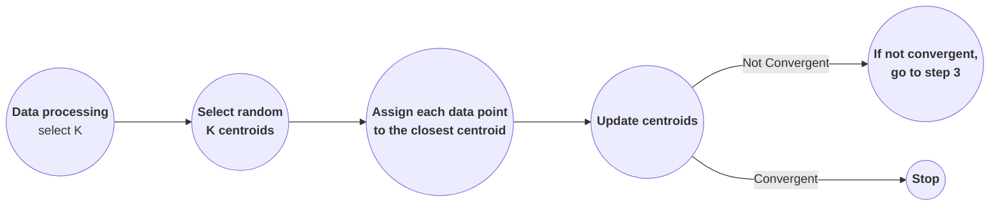
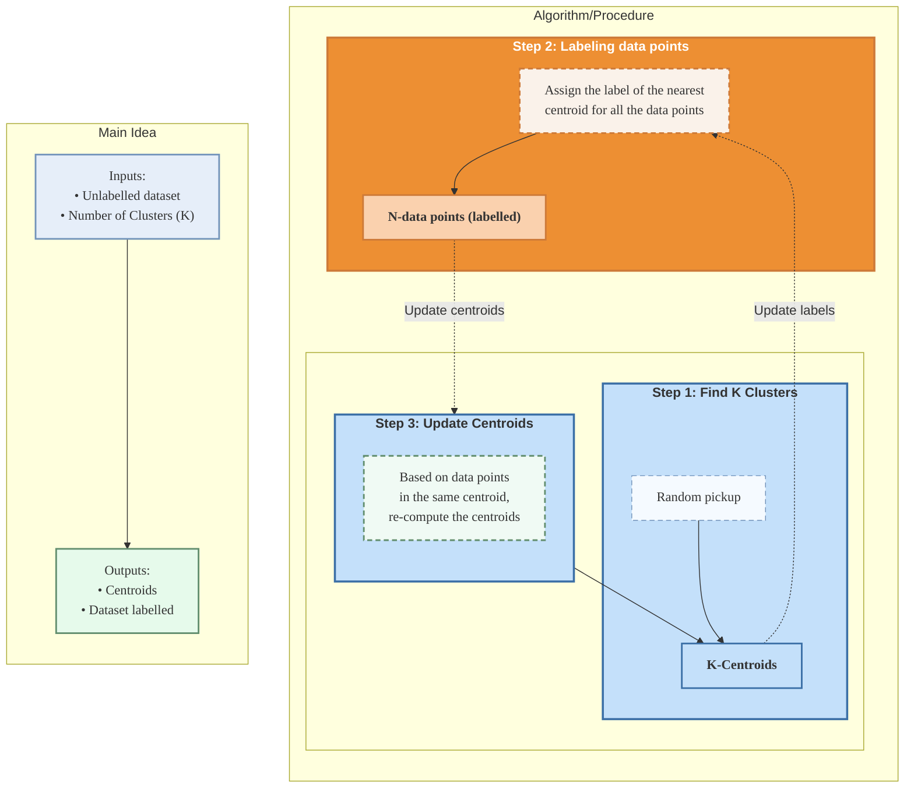

**Acknowledgement:** This post is based mainly on Dr. Quang-Vinh Dinh's presentation and slides and partly on on TA, STA, and peers' responses from the course AIO2025 offered by AI VIETNAM.

**Relevance:** The audience of this lecture were those who have read [Machine Learning 101 Warm-up](), had some coding experience, and known a bit of AI knowledge. 

In today's post, we'll explore K-Means and Unsupervised Learning. We'll also discuss some applications in AI including tabular, image, and text data.

<hr>

A dataset in Supervised Learning (SL) comes with two parts: X (the features) and Y (the labels). SL is used to solve classification and regression problems where we need the input data X and their results Y in order for a model to learn. In Unsupervised Learning (USL), a dataset only has X. Since there is no Y, USL cannot solve problems like classification or regression. Instead it can work on clustering problems which aim to group data points based on some property/condition; different properties/features can give different output.

## **Motivation**
Let's discuss a real-life problem. We have a dataset of sales from customers; this dataset does not give any information on customers, that is, is not labeled. The data is scattered and the whole dataset is not compactly represented.

The questions become, **"How can we extract some useful information? More specifically, how can we classify customers into VIP and normal groups?"**.

For this particular question, we can think of the way and amount each group spends. The potential VIP tends to spend much more than a normal customer. Qualitatively, this can result in a clear divider between two groups. Visually, the customers are grouped into two sets which do not intersect/overlap with each other. 

Nonetheless, to conclude it quantitatively, we need to have numbers to support our conjecture. Let's experiment with a sample dataset.

<details class = "bordered-block">
    <summary>
        <strong>Sample</strong>
    </summary>
    <div class = "bordered-inner-block language-python">
        <strong>Problem statement:</strong> A sample set of spending amounts is $\{\$6, \$8, \$10, \$12, \$36, \$40, \$41\}$.
        <br>
        <strong>Breakdown:</strong> 
        <ul>
            <li> $C_1$ and $C_2$ are the centers of normal and VIP groups, respectively. </li>
            <li> $R_1$ and $R_2$ are the radii of normal and VIP groups, respectively. </li>
            <li> $S$ is the <strong>signal</strong> of the dataset based on grouping/clustering. </li>
        </ul> 
        <strong>Idea:</strong> Experiment different ways to form groups from the dataset, paraphrase them mathematically, and conclude which one may be best. This experimental method is built on the idea from statistics---the distribution of a dataset.
        <ol>
            <li> <strong>Separate</strong> the dataset into <strong>different clusters</strong>. </li>
            <li> <strong>Determine $C$</strong> which acts as a cluster's mean. </li>
            <li> <strong>Determine $R$</strong> which represents how spread out each cluster is, that is, loosely acts as a group's standard deviation. </li>
            <li> <strong>Determine $S$</strong> which represents how spread out the entire dataset is from the centers. </li>
            <li> <strong>Compare $S$</strong> and <strong>choose one with the smallest signal</strong>. The smaller it is, the more compact the clusters are, the more meaningful the grouping is potentially. </li>
            We pick the first grouping for $2 < 4.57 < 5.73$.
        </ol> 
        From the conclusion above and the formulae in the table below, we <em>observe</em> that <strong>a data point will belong to a set if it is closer to its center than other centers</strong>. 
        $$\begin{align}
        \label{observation-kmeans-clustering}
        Set_i = \{x_p: |x_p - C_i| \le |x_p - C_j| \forall j\}
        \end{align}$$
        <table class = "language-python">
            <tr>
                <th>No</th>
                <th>Groups</th>
                <th>
                    Center of the Cluster
                    $$C = \frac{\text{Sum of values}}{\text{Number of values}} = \frac{\sum_{p=1}^{k} x_p}{k}$$
                </th>
                <th>
                    Radius of the Cluster
                    $$R = \frac{\text{Sum of distances from values to center}}{\text{Number of values}} = \frac{\sum_{p=1}^{k} |x_p - C|}{k}$$
                </th>
                <th>
                    Signal of the Clusters
                    $$S = \frac{\text{Sum of radii}}{\text{Number of groups}}$$
                </th>
            </tr>
            <tr>
                <td rowspan="2">1</td>
                <td>
                    Normal
                    $$\{6, 8, 10, 12\}$$
                </td>
                <td>$$C_1 = \frac{6 + 8 + 10 + 12}{4} = 9$$</td>
                <td>$$R_1 = \frac{|6 - 9| + |8 - 9| + |10 - 9| + |12 - 9|}{4} = 2$$</td>
                <td rowspan="2">
                $$\begin{align*}
                &S = \frac{R_0 + R_1}{2} \\ 
                &= \frac{2 + 2}{2} = 2
                \end{align*}$$
                </td>
            </tr>
            <tr>
                <td>
                    VIP
                    $$\{36, 40, 41\}$$
                </td>
                <td>$$C_2 = \frac{36 + 40 + 41}{3} = 39$$</td>
                <td>$$R_2 = \frac{|36 - 39| + |40 - 39| + |41 - 39|}{4} = 2$$</td>
            </tr>
            <tr>
                <td rowspan="2">2</td>
                <td>
                    Normal
                    $$\{6, 8, 10\}$$
                </td>
                <td>$$C_1 = \frac{6 + 8 + 10}{3} = 8$$</td>
                <td>$$R_1 = \frac{|6 - 9| + |8 - 9| + |10 - 9|}{3} = \frac{4}{3} \approx 1.33$$</td>
                <td rowspan="2">
                $$\begin{align*}
                &S = \frac{R_0 + R_1}{2} \\
                &\approx \frac{1.33 + 10.13}{2} = 5.73
                \end{align*}$$
                </td>
            </tr>
            <tr>
                <td>
                    VIP
                    $$\{12, 36, 40, 41\}$$
                </td>
                <td>$$C_2 = \frac{12 + 36 + 40 + 41}{4} = 32.25$$</td>
                <td>$$R_2 = \frac{|12 - 32.25| + |36 - 32.25| + |40 - 32.25| + |41 - 32.25|}{4} = 10.13$$</td>
            </tr>
            <tr>
                <td rowspan="2">3</td>
                <td>
                    Normal
                    $$\{6, 8, 10, 12\}$$
                </td>
                <td>$$C_1 = \frac{6 + 8 + 10 + 12 + 36}{5} = 14.4$$</td>
                <td>$$R_1 = \frac{|6 - 14.4| + |8 - 14.4| + |10 - 14.4| + |12 - 14.4| + |36 - 14.4|}{5} = 8.64$$</td>
                <td rowspan="2">
                $$\begin{align*}
                &S = \frac{R_0 + R_1}{2} \\
                &\approx \frac{8.64 + 0.5}{2} = 4.57
                \end{align*}$$
                </td>
            </tr>
            <tr>
                <td>
                    VIP
                    $$\{36, 40, 41\}$$
                </td>
                <td>$$C_2 = \frac{40 + 41}{2} = 40.5$$</td>
                <td>$$R_2 = \frac{|40 - 40.5| + |41 - 40.5|}{2} = 0.5$$</td>
            </tr>
        </table>
        <br>
        <figure style="margin-top: 0; ping-top: 0;">
            <iframe src="https://www.geogebra.org/classic/eweqcfvf?embed" title='Interactive GeoGebra applet one-dimensional clustering demo.' frameborder='0' height="700px" width="100%" style="border: 1px solid #ddd; margin-top: 0; ping-top: 0;" allowfullscreen>Your browser does not support iframes. View the interactive applet <a href="https://www.geogebra.org/classic/eweqcfvf" target="_blank" rel="noopener">here</a>.</iframe>
            <figcaption style="font-size:0.875em"> <em>Figure 1.</em> Drag points around for different datasets. Use the sliders for each point to change its group assignment. The applet updates clusters, their centers, and average radii instantly. Click on the symbol in the bottom right corner to open the applet in full-screen mode. Drag boxes and sliders for your convenience. 
            If the applet does not load, you can open it directly <a href="https://www.geogebra.org/classic/eweqcfvf" target="_blank" rel="noopener">here</a>.</figcaption>
        </figure>
    </div>
</details>
<br>

:pushpin: **Note:** Even though the solution presented in the Sample works for a toy dataset, some problems needs addressing with this approach for it to work in real-world applications.
- Manually grouping and trying many possible of them for an actual dataset are very inefficient.
    - There is no clear way on how to make a grouping better.
- Unsystematically forming/guessing a grouping leads to a center biased by the grouping. 
    - It's hardly possible to get a proper center and its cluster.

To uplift the solution we discussed above, we can *reverse the process* by initially picking centers and then forming clusters.  

<details class = "bordered-block">
    <summary>
        <strong>Improved Sample</strong>
    </summary>
    <div class = "bordered-inner-block language-python">
        <strong>Problem statement:</strong> A sample set of spending amounts is $\{\$6, \$8, \$10, \$12, \$36, \$40, \$41\}$.
        <br>
        <strong>Breakdown:</strong> The formulae for the following values stay the same.
        <ul>
            <li> $C_i$ is the center of a group. </li>
            <li> $R_i$ is the radius of a group. </li>
            <li> $Set_i$ is a group. </li>
            <li> $S$ is the signal of the dataset based on grouping/clustering. </li>
        </ul> 
        <strong>Idea:</strong> We guess centers and then form their clusters. We repeat this process until groups stop changing. 
        <ol>
            <li> <strong>Randomly select $C_i$'s</strong>. </li>
                In this example, let's initialize $C_1 = 8$ and $C_2 = 29$.
            <li> <strong>Assign a data point to its nearest $C_i$</strong>. </li>
                Based on \eqref{observation-kmeans-clustering}, we have
                $$Set_1 = \{6, 8, 10, 12\}$$ and $$Set_2 = \{36, 40, 41\}.$$
            <li> <strong>Update $C_i$'s</strong> based on new information. </li>
                Now with two clusters above, $C_1 = 9$ and $C_2 = 39$.
            <li> <strong>Determine $R_i$'s</strong> based on the new $C_i$'s. </li>
                $R_1 = 2$ and $R_2 = 2$
            <li> <strong>Determine $S$</strong>. </li>
                $S = 2$ since $K = 2$.
            <li> <strong>Reuse $C_i$'s and repeat steps 2-4 until $S$ remains unchanged</strong>, that is, the clusters, centers, and radii stay stable. </li>
                In this particular example, all the values do not change after being recalculated. So, this is our wanted grouping. 
        </ol>
        <figure style="margin-top: 0; ping-top: 0;">
            <iframe src="https://www.geogebra.org/classic/gcwpdwp4?embed" title='Interactive GeoGebra applet one-dimensional K-Means clustering demo.' frameborder='0' height="700px" width="100%" style="border: 1px solid #ddd; margin-top: 0; ping-top: 0;" allowfullscreen>Your browser does not support iframes. View the interactive applet <a href="https://www.geogebra.org/classic/gcwpdwp4" target="_blank" rel="noopener">here</a>.</iframe>
            <figcaption style="font-size:0.875em"> <em>Figure 2.</em> Drag points around and click the "Update Clusters" for automatic group reassignment. The applet updates clusters, their centers, and average radii instantly. Click on the symbol in the bottom right corner to open the applet in full-screen mode. Drag boxes and sliders for your convenience. 
            If the applet does not load, you can open it directly <a href="https://www.geogebra.org/classic/gcwpdwp4" target="_blank" rel="noopener">here</a>.</figcaption>
        </figure>
    </div>
</details>
<br>

## **$K$-Means** 
The improved version of the example above follows the exact procedure for grouping $n$ observations into $K$ clusters based on the distance in $K$-Means.

### **Procedure**
We should always preprocess the data first. Then we can apply $K$-Means to a ML model in the following steps.
1. *Initialize* the value of $K$.
2. *Select random $K$ centroid*.
3. *Assign each data point to the closest centroid*. 
4. *Update a new centroid* of each cluster.
5. *If not convergent, go to step 3. Otherwise, stop*.


<figcaption style='text-align: center; width: 100%; font-size: 0.875em; margin-top:-5px; margin-bottom:15px;'>
    <em>Figure 3.</em> K-Means Procedure
</figcaption>

:pushpin: **Note:** $K$-Means always converges to a local minimum but does not guarantee convergence to global minimum (optimum). The result is dependent on the initialization.

### **$K$-Means Algorithm**
You may question, **"Why do we need to cluster data points? What do we do with them?**

This question is on point. In USL, data is unlabeled, thus clustering data points into appropriate and suitable groups is the key to label the entire dataset based on the problem requirement.


<figcaption style='text-align: center; width: 100%; font-size: 0.875em; margin-top:-5px; margin-bottom:15px;'>
    <em>Figure 4.</em> Detailed K-Means Algorithm 
</figcaption>

### **Formula**
We can write these steps in mathematical expressions. 

<div class="math-box">
    $\text{Consider } \{x_1, \cdots, x_n\} \text{ where } x_i \in \mathbb{R}^d.$ 
    $\text{Consider an initial set of K centroids } c_0^{(t)}, \cdots, c_K^{(t)}.$
    $\text{Let } S = \{S_0, \cdots, S_K\} \text{ be } K \text{ clusters.}$
    <br>
    <u><strong>Assignment step</strong></u>
    $$\begin{align}
    S_i^{(t)} = \{x_p : \left\Vert x_p - c_i^{(t)} \right\Vert ^2 \le \left\Vert x_p - c_j^{(t)} \right\Vert ^2 \forall j, 0 \le j \le k \}
    \end{align}$$
    <u><strong>Update step</strong></u>
    $$\begin{align}
    c_i^{(t+1)} = \frac{1}{|S_i^{(t)}|} \sum_{x \in S_i^{(t)}} x
    \end{align}$$
</div>
<br>

The *goal of the clustering problem* is to make the groups *tight and compact* while still covering all the data. Mathematically, it can be expressed as follows. 

<div class="math-box">
    $\text{Consider } \{x_1, \cdots, x_n\} \text{ where } x_i \in \mathbb{R}^d.$ 
    $\text{Consider an initial set of K centroids } c_0^{(t)}, \cdots, c_K^{(t)}.$
    $\text{Let } S = \{S_0, \cdots, S_K\} \text{ be } K \text{ clusters.}$
    <br>
    $\text{For a given $K$, find the partition } S \text{ that minimizes the dispersion of data points within their clusters, i.e.,}$
    $$\begin{align}
    \underset{S}{argmin} \sum_{i=0}^{k-1} \sum_{x \in S_i} \left\Vert x - c_i^{(t)} \right\Vert ^2
    \end{align}$$
    $\text{for } \left\Vert u \right\Vert _{L^2} ^2 = u_1^2 + \cdots + u_n^2.$
</div>

<hr>

## **Tabular Data**
<details class = "bordered-block">
    <summary>
        <strong>Practice Exercises</strong>
    </summary>
    <div class = "bordered-inner-block language-python">
        <strong>Exercise 1:</strong> Use the following Iris data table and step-by-step $K$-Means procedure with Euclidean distance to label data points. Fill in the table below for each iteraton. Take $K = 2$, $c_0 = 1.4$, and $c_1 = 1$. Check the answer with code snippet below.
        
        <table class = "language-python">
            <tr>
                <th>Index</th>
                <th>Length</th>
                <th>Distance to $c_0$</th>
                <th>Distance to $c_1$</th>
                <th>Label</th>
                <th>New Centroids</th>
            </tr>
            <tr>
                <td class = "centered_td">0</td>
                <td class = "centered_td">1.4</td>
                <td></td>
                <td></td>
                <td></td>
            </tr>
            <tr>
                <td class = "centered_td">1</td>
                <td class = "centered_td">1</td>
                <td></td>
                <td></td>
                <td></td>
            </tr>
            <tr>
                <td class = "centered_td">2</td>
                <td class = "centered_td">1.5</td>
                <td></td>
                <td></td>
                <td></td>
            </tr>
            <tr>
                <td class = "centered_td">3</td>
                <td class = "centered_td">3.1</td>
                <td></td>
                <td></td>
                <td></td>
            </tr>
            <tr>
                <td class = "centered_td">4</td>
                <td class = "centered_td">3.8</td>
                <td></td>
                <td></td>
                <td></td>
            </tr>
            <tr>
                <td class = "centered_td">5</td>
                <td class = "centered_td">4.1</td>
                <td></td>
                <td></td>
                <td></td>
            </tr>
        </table>
        <br>
        <strong>Exercise 2:</strong> Do the same as exercise 1 and make suitable tables for the age-expenditure table with
        <ol>
            <li> $K = 2$, $c_0 = (18, 80)$ and $c_1 = (22, 85)$$ </li>
            <li> $K = 3$, $c_0 = (22, 85)$, $c_1 = (30, 50)$, and $c_2 = (34, 64)$ </li>
        </ol>
        
        <strong>Exercise 3:</strong> Based on the code snippet for exercise 1 below and the following exercises, write code for exercise 2.
        <br>
        <strong>Exercise 4:</strong> What is the output of the following? Explain your answer.
<pre>
<code>
data = np.random.rand(64,2)
centroids = np.random.rand(5,2)
distances = (data - centroids)**2

print(data.shape)
print(centroids.shape)
print(distances.shape)
</code>
</pre>
<pre>
<code>
data = np.random.rand(64,2)

data1 = data[:, np.newaxis, :]
data2 = data.reshape(1, 1, -1)

print(data1.shape)
print(data2.shape)
</code>
</pre>
<pre>
<code>
data = np.random.rand(34,4)
centroids = np.random.rand(3,4)
distances = np.sqrt((data[:, np.newaxis, :] - centroids)**2)

print(data.shape)
print(centroids.shape)
print(distances.shape)
</code>
</pre>
        <strong>Exercise 5:</strong> Which one gives the solution?
<pre>
<code>
# 32 point, 3 dimensions (3 features), 4 centroids
squared_norm = np.random.rand(32,3,4)
# what is the distance between points and centroids?
np.sqrt(squared_norm.sum(axis=0))
np.sqrt(squared_norm.sum(axis=1))
np.sqrt(squared_norm.sum(axis=2))
</code>
</pre>
<pre>
<code>
# 32 point, 3 dimensions (3 features), 2 centroids
distances_detail = np.random.rand(32,3,2)
# what is the distance between points and centroids?
np.linalg.norm(distances_detail,axis=0)
np.linalg.norm(distances_detail,axis=1)
np.linalg.norm(distances_detail,axis=2)
</code>
</pre>
    </div>
</details>
<br>

Below is the code snippet for the practice exercise 1 just above.

```python
import numpy as np

X = np.array([1.4, 1.0, 1.5, 3.1, 3.8, 4.1])

# step 1
k = 2

# step 2
centroids = X[:k]

X = X.reshape(6,1)

while True:
    # step 3a
    distances = np.sqrt((X - centroids)**2)
    print(f'distances:\n {distances}')

    # step 3b
    labels = np.argmin(D, axis=1)
    print(f'labels:\n {labels}')

    # step 4: update centroids
    new_centroids = np.array([X[L == i].mean() for i in range(k)])

    # step 5: check convergence
    if np.all(centroids == new_centroids):
        break

    # step 2: centroids
    centroids = new_centroids
    print(f'centroids:\n {centroids}')
```

We can also use an available package to solve the problem as well.

```python
from sklearn.cluster import KMeans

kmeans = KMeans(n_clusters=2, max_iter=10)
kmeans.fit(X.reshape(6,1))
labels = kmeans.labels_
print(labels)
print(kmeans.inertia_)

for x, label in zip(X, labels):
    print(f'Cluster {label}: {x}')
```

In this example, our dataset consists of six data points $\\\{x_1, \cdots, x_6\\\}$ which are all one-dimensional real numbers, denoted $\mathbb{R^1}$ or $\mathbb{R}$. The initial $K = 2$ determines two clusters $\\\{S_0, S_1\\\}$. 

### **Formula**
Another *critical obstacle* when working with $K$-Means algorithm is to *obtain the optimal $K$ or the optimal number of clusters*. To do so, we need to determine how well the data points spread out from the centroids of their clusters. 

The **Within-Cluster Sum of Squares (WCSS)** works like a signal for the best $K$ (like in the Sample example); it measures how compact the clusters are using a clustering procedure, making it easier to compare different $K$-clustering results. 

The value of WCSS declines to 0 as $K$ grows. Using WCSS, we can figure out the optimal number of clusters via a method called the **Elbow Method**. This method aims to pick the **elbow** value where the rate of decrease for WCSS slows down sharply.

<div class="math-box">
    $\text{Consider } \{x_1, \cdots, x_n\} \text{ where } x_i \in \mathbb{R}^d.$ 
    $\text{Consider an initial set of K centroids } c_0, \cdots, c_K.$
    $\text{Let } S = \{S_0, \cdots, S_K\} \text{ be K clusters.}$
    $\text{WCSS is the sum of squared distances between each data point and the centroid of its assigned cluster and can be mathematically expressed as}$
    $$\begin{align}
    WCSS = \sum_{i=0}^{k-1} \sum_{x \in S_i} \left\Vert x - c_i \right\Vert ^2
    \end{align}$$
    $\text{for } \left\Vert u \right\Vert _{L^2} ^2 = u_1^2 + \cdots + u_n^2.$
</div>

<hr>

## **Image and Text Data**
We can apply $K$-Means to image and text datasets as well. Before doing so, we must preprocess the data so that it becomes pertain to the algorithm.

### **Image Data**
An image dataset can have many images. An image can be described as a matrix whose shape depends on its image type.

To treat this kind of dataset as input of $K$-Means algorithm, we first need to make each image into a vector just like a row/data point in the tabular data above. That is, we flatten matrices. 

In practice, *Deep Learning* uses a *magic function* to process an image to extract its important parts which determine the content of the image. Just like our *human brain*, when we look at a cat or a dog image, we can tell what kind they are based on their face. The model completing this process is called a *pretrained model*. This reduces the size of data by a significant amount.

### **Text Data**
Similar to image data, there is a *magic function* to learn important words which speak the main content of an article.

For text, we need to convert it into numeric values using vectorization algorithms before using $K$-Means.

<hr>

## :speech_balloon: **FAQ**
Here are some good questions asked during class. The answers to these questions came from either some admin, TA, STA, or members of AIO2025.

| Questions | Answers |
|-----------|---------|
|  |  |

<br>

<!-- #### Check List

- [x] Exercise 1 (date)
- [ ] Exercise 2 (date)
  - [x] Put on left sock
  - [ ] Put on right sock
- [x] Go to school -->
