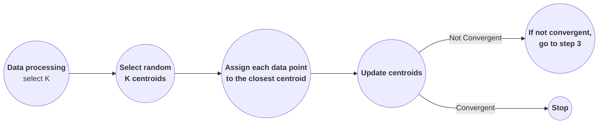
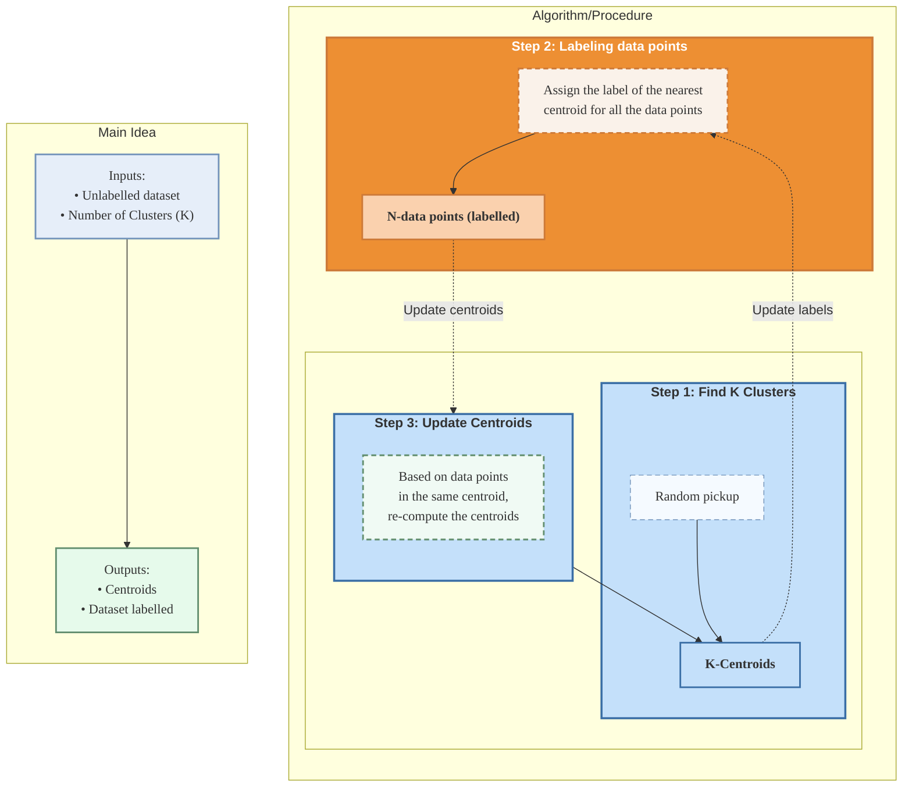

**Acknowledgement:** This post is based mainly on TA Duong Dinh Thang's presentation and slides and partly on on TA, STA, and peers' responses from the course AIO2025 offered by AI VIETNAM.

**Relevance:** The audience of this lecture were those who have read [Machine Learning 101 Warm-up](), had some coding experience, and known a bit of AI knowledge. 

In today's post, we'll explore KNN and Supervised Learning. We'll also discuss some applications in AI including a text classification problem and a medical case study.

<hr>

A dataset in Supervised Learning (SL) comes with two parts: X (the features) and Y (the labels). SL is used to solve classification and regression problems where we need the input data X and their results Y in order for a model to learn. In Unsupervised Learning (USL), a dataset only has X. Since there is no Y, USL cannot solve problems like classification or regression. Instead it can work on clustering problems which aim to group data points based on some property/condition; different properties/features can give different output.

## **Motivation**
Let's discuss a real-life problem. We have a dataset of sales from customers; this dataset does not give any information on customers, that is, is not labeled. The data is scattered and the whole dataset is not compactly represented.

The questions become, **"How can we extract some useful information? More specifically, how can we classify customers into VIP and normal groups?"**.

For this particular question, we can think of the way and amount each group spends. The potential VIP tends to spend much more than a normal customer. Qualitatively, this can result in a clear divider between two groups. Visually, the customers are grouped into two sets which do not intersect/overlap with each other. 

Nonetheless, to conclude it quantitatively, we need to have numbers to support our conjecture. Let's experiment with a sample dataset.

<details class = "bordered-block">
    <summary>
        <strong>Sample</strong>
    </summary>
    <div class = "bordered-inner-block language-python">
        <strong>Problem statement:</strong> A sample set of spending amounts is $\{\$6, \$8, \$10, \$12, \$36, \$40, \$41\}$.
        <br>
        <strong>Breakdown:</strong> 
        <ul>
            <li> $C_1$ and $C_2$ are the centers of normal and VIP groups, respectively. </li>
            <li> $R_1$ and $R_2$ are the radii of normal and VIP groups, respectively. </li>
            <li> $S$ is the signal of the dataset based on grouping/clustering. </li>
        </ul> 
        <strong>Idea:</strong> Experiment different ways to form groups from the dataset, paraphrase them mathematically, and conclude which one may be best. This experimental method is built on the idea from statistics---the distribution of a dataset.
        <ol>
            <li> <strong>Separate</strong> the dataset into <strong>different clusters</strong>. </li>
            <li> <strong>Determine $C$</strong> which acts as a cluster's mean. </li>
            <li> <strong>Determine $R$</strong> which represents how spread out each cluster is, that is, loosely acts as a group's standard deviation. </li>
            <li> <strong>Determine $S$</strong> which represents how spread out the entire dataset is from the centers. </li>
            <li> <strong>Compare $S$</strong> and <strong>choose one with the smallest signal</strong>. The smaller it is, the more compact the clusters are, the more meaningful the grouping is potentially. </li>
            We pick the first grouping for $2 < 4.57 < 5.73$.
        </ol> 
        From the conclusion above and the formulae in the table below, we <em>observe</em> that <strong>a data point will belong to a set if it is closer to its center than other centers</strong>. 
        $$\begin{align}
        \label{observation-kmeans-clustering}
        Set_i = \{x_p: |x_p - C_i| \le |x_p - C_j| \forall j\}
        \end{align}$$
        <table class = "language-python">
            <tr>
                <th>No</th>
                <th>Groups</th>
                <th>
                    Center of the Cluster
                    $$C = \frac{\text{Sum of values}}{\text{Number of values}} = \frac{\sum_{p=1}^{k} x_p}{k}$$
                </th>
                <th>
                    Radius of the Cluster
                    $$R = \frac{\text{Sum of distances from values to center}}{\text{Number of values}} = \frac{\sum_{p=1}^{k} |x_p - C|}{k}$$
                </th>
                <th>
                    Signal of the Clusters
                    $$S = \frac{\text{Sum of radii}}{\text{Number of groups}}$$
                </th>
            </tr>
            <tr>
                <td rowspan="2">1</td>
                <td>
                    Normal
                    $$\{6, 8, 10, 12\}$$
                </td>
                <td>$$C_1 = \frac{6 + 8 + 10 + 12}{4} = 9$$</td>
                <td>$$R_1 = \frac{|6 - 9| + |8 - 9| + |10 - 9| + |12 - 9|}{4} = 2$$</td>
                <td rowspan="2">
                $$\begin{align*}
                &S = \frac{R_0 + R_1}{2} \\ 
                &= \frac{2 + 2}{2} = 2
                \end{align*}$$
                </td>
            </tr>
            <tr>
                <td>
                    VIP
                    $$\{36, 40, 41\}$$
                </td>
                <td>$$C_2 = \frac{36 + 40 + 41}{3} = 39$$</td>
                <td>$$R_2 = \frac{|36 - 39| + |40 - 39| + |41 - 39|}{4} = 2$$</td>
            </tr>
            <tr>
                <td rowspan="2">2</td>
                <td>
                    Normal
                    $$\{6, 8, 10\}$$
                </td>
                <td>$$C_1 = \frac{6 + 8 + 10}{3} = 8$$</td>
                <td>$$R_1 = \frac{|6 - 9| + |8 - 9| + |10 - 9|}{3} = \frac{4}{3} \approx 1.33$$</td>
                <td rowspan="2">
                $$\begin{align*}
                &S = \frac{R_0 + R_1}{2} \\
                &\approx \frac{1.33 + 10.13}{2} = 5.73
                \end{align*}$$
                </td>
            </tr>
            <tr>
                <td>
                    VIP
                    $$\{12, 36, 40, 41\}$$
                </td>
                <td>$$C_2 = \frac{12 + 36 + 40 + 41}{4} = 32.25$$</td>
                <td>$$R_2 = \frac{|12 - 32.25| + |36 - 32.25| + |40 - 32.25| + |41 - 32.25|}{4} = 10.13$$</td>
            </tr>
            <tr>
                <td rowspan="2">3</td>
                <td>
                    Normal
                    $$\{6, 8, 10, 12\}$$
                </td>
                <td>$$C_1 = \frac{6 + 8 + 10 + 12 + 36}{5} = 14.4$$</td>
                <td>$$R_1 = \frac{|6 - 14.4| + |8 - 14.4| + |10 - 14.4| + |12 - 14.4| + |36 - 14.4|}{5} = 8.64$$</td>
                <td rowspan="2">
                $$\begin{align*}
                &S = \frac{R_0 + R_1}{2} \\
                &\approx \frac{8.64 + 0.5}{2} = 4.57
                \end{align*}$$
                </td>
            </tr>
            <tr>
                <td>
                    VIP
                    $$\{36, 40, 41\}$$
                </td>
                <td>$$C_2 = \frac{40 + 41}{2} = 40.5$$</td>
                <td>$$R_2 = \frac{|40 - 40.5| + |41 - 40.5|}{2} = 0.5$$</td>
            </tr>
        </table>
        <br>
        <figure style="margin-top: 0; ping-top: 0;">
            <iframe src="https://www.geogebra.org/classic/eweqcfvf?embed" title='Interactive GeoGebra applet one-dimensional clustering demo.' frameborder='0' height="700px" width="100%" style="border: 1px solid #ddd; margin-top: 0; ping-top: 0;" allowfullscreen>Your browser does not support iframes. View the interactive applet <a href="https://www.geogebra.org/classic/eweqcfvf" target="_blank" rel="noopener">here</a>.</iframe>
            <figcaption style="font-size:0.875em"> <em>Figure 1.</em> Drag points around for different datasets. Use the sliders for each point to change its group assignment. The applet updates clusters, their centers, and average radii instantly. Click on the symbol in the bottom right corner to open the applet in full-screen mode. Drag boxes and sliders for your convenience. 
            If the applet does not load, you can open it directly <a href="https://www.geogebra.org/classic/eweqcfvf" target="_blank" rel="noopener">here</a>.</figcaption>
        </figure>
    </div>
</details>
<br>

:pushpin: **Note:** Even though the solution presented in the Sample works for a toy dataset, some problems needs addressing with this approach for it to work in real-world applications.
- Manually grouping and trying many possible of them for an actual dataset are very inefficient.
    - There is no clear way on how to make a grouping better.
- Unsystematically forming/guessing a grouping leads to a center biased by the grouping. 
    - It's hardly possible to get a proper center and its cluster.

To uplift the solution we discussed above, we can *reverse the process* by initially picking centers and then forming clusters.  

<details class = "bordered-block">
    <summary>
        <strong>Improved Sample</strong>
    </summary>
    <div class = "bordered-inner-block language-python">
        <strong>Problem statement:</strong> A sample set of spending amounts is $\{\$6, \$8, \$10, \$12, \$36, \$40, \$41\}$.
        <br>
        <strong>Breakdown:</strong> The formulae for the following values stay the same.
        <ul>
            <li> $C_i$ is the center of a group. </li>
            <li> $R_i$ is the radius of a group. </li>
            <li> $Set_i$ is a group. </li>
            <li> $S$ is the signal of the dataset based on grouping/clustering. </li>
        </ul> 
        <strong>Idea:</strong> We guess centers and then form their clusters. We repeat this process until groups stop changing. 
        <ol>
            <li> <strong>Randomly select $C_i$'s</strong>. </li>
                In this example, let's initialize $C_1 = 8$ and $C_2 = 29$.
            <li> <strong>Assign a data point to its nearest $C_i$</strong>. </li>
                Based on \eqref{observation-kmeans-clustering}, we have
                $$Set_1 = \{6, 8, 10, 12\}$$ and Set_2 = \{36, 40, 41\}$$$$
            <li> <strong>Update $C_i$'s</strong> based on new information. </li>
                Now with two clusters above, $C_1 = 9$ and $C_2 = 39$.
            <li> <strong>Determine $R_i$'s</strong> based on the new $C_i$'s. </li>
                $R_1 = 2$ and $R_2 = 2$
            <li> <strong>Determine $S$</strong>. </li>
                $S = 2$
            <li> <strong>Reuse $C_i$'s and repeat steps 2-4 until $S$ remains unchanged</strong>, that is, the clusters, centers, and radii stay stable. </li>
                In this particular example, all the values do not change after being recalculated. So, this is our wanted grouping. 
        </ol>
        <figure style="margin-top: 0; ping-top: 0;">
            <iframe src="https://www.geogebra.org/classic/gcwpdwp4?embed" title='Interactive GeoGebra applet one-dimensional K-Means clustering demo.' frameborder='0' height="700px" width="100%" style="border: 1px solid #ddd; margin-top: 0; ping-top: 0;" allowfullscreen>Your browser does not support iframes. View the interactive applet <a href="https://www.geogebra.org/classic/gcwpdwp4" target="_blank" rel="noopener">here</a>.</iframe>
            <figcaption style="font-size:0.875em"> <em>Figure 2.</em> Drag points around and click the "Update Clusters" for automatic group reassignment. The applet updates clusters, their centers, and average radii instantly. Click on the symbol in the bottom right corner to open the applet in full-screen mode. Drag boxes and sliders for your convenience. 
            If the applet does not load, you can open it directly <a href="https://www.geogebra.org/classic/gcwpdwp4" target="_blank" rel="noopener">here</a>.</figcaption>
        </figure>
    </div>
</details>
<br>

## **$K$-Means** 
The improved version of the example above follows the exact procedure for finding $K$ clusters in $K$-Means

### **Procedure**
We should always preprocess the data first. Then we can apply it to a ML model in the following steps.
1. *Initialize* the value of $K$.
2. *Select random $K$ centroid*.
3. *Assign each data point to the closest centroid*. 
4. *Update a new centroid* of each cluster.
5. *If not convergent, go to step 3. Otherwise, stop*.


<figcaption style='text-align: center; width: 100%; font-size: 0.875em; margin-top:-5px; margin-bottom:15px;'>
    <em>Figure 3.</em> K-Means Procedure
</figcaption>

:pushpin: **Note:** $K$-Means always converges to a local minimum but does not guarantee convergence to global minimum (optimum). The result is dependent on the initialization.

### **$K$-Means Algorithm**
You may question, **"Why do we need to cluster data points? What do we do with them?**

This question is on point. In USL, data is unlabeled, thus clustering data points into appropriate and suitable groups is the key to label the entire dataset based on the problem requirement.


<figcaption style='text-align: center; width: 100%; font-size: 0.875em; margin-top:-5px; margin-bottom:15px;'>
    <em>Figure 4.</em> Detailed K-Means Algorithm 
</figcaption>

### **Formulae**

<div class="math-box">
    $\text{Consider } \{x_1, \cdots, x_n\} \text{ where } x_i \in \mathbb{R}^d.$ 
    $\text{Consider an initial set of K centroids } c_0, \cdots, c_K.$
    $\text{Let } S = \{S_0, \cdots, S_K\} \text{ be K clusters.}$
    $$\underset{S}{argmin} \sum_{i=0}^{k-1} \sum_{x \in S_i} \left\Vert x - c_i \right\Vert ^2$$
</div>

<hr>

## **Tabular Data**
<details class = "bordered-block">
    <summary>
        <strong>Practice Exercises</strong>
    </summary>
    <div class = "bordered-inner-block language-python">
        <strong>Exercise 1:</strong> Use the following table image and step-by-step $K$-Means procedure with Euclidean distance to label data points. Fill in the table below for each iteraton. Take $k = 2, c_1 = 1.4, c_2 = 1$.
        
        <table class = "language-python">
            <tr>
                <th>Index</th>
                <th>Length</th>
                <th>Distance to $c_0$</th>
                <th>Distance to $c_1$</th>
                <th>Label</th>
                <th>New Centroids</th>
            </tr>
            <tr>
                <td class = "centered_td">0</td>
                <td class = "centered_td">1.4</td>
                <td></td>
                <td></td>
                <td></td>
            </tr>
            <tr>
                <td class = "centered_td">1</td>
                <td class = "centered_td">1</td>
                <td></td>
                <td></td>
                <td></td>
            </tr>
            <tr>
                <td class = "centered_td">2</td>
                <td class = "centered_td">1.5</td>
                <td></td>
                <td></td>
                <td></td>
            </tr>
            <tr>
                <td class = "centered_td">3</td>
                <td class = "centered_td">3.1</td>
                <td></td>
                <td></td>
                <td></td>
            </tr>
            <tr>
                <td class = "centered_td">4</td>
                <td class = "centered_td">3.8</td>
                <td></td>
                <td></td>
                <td></td>
            </tr>
            <tr>
                <td class = "centered_td">5</td>
                <td class = "centered_td">4.1</td>
                <td></td>
                <td></td>
                <td></td>
            </tr>
        </table>
        <br>
        <strong>Exercise 2:</strong> Do the same as exercise 1 for $x\_test = (2.4, 0.8)$ and $x\_test = (2.6, 0.8)$ when
        <ol>
            <li> $k = 1$ </li>
            <li> $k = 3$ </li>
            <li> $k = 5$ </li>
        </ol>
        
        <strong>Exercise 3:</strong> Write code for both exercises above.
        <br>
        <strong>Exercise 4:</strong> Use the following table and step-by-step procedure with Euclidean distance to predict the salary for $experience = 5.3$ when
        <ol>
            <li> $k = 2$ </li>
            <li> $k = 3$ </li>
            <li> $k = 4$ </li>
        </ol>
        
        <strong>Exercise 5:</strong> Write code for exercise 4 above.
    </div>
</details>
<br>


<figure>
    <div style='display: flex; flex-wrap:wrap; column-gap: 20px; justify-content: center'>
        {% include figure.liquid loading="eager" path="assets\aio2025\M03W02\tuesday_knn_exercise_procedure_2features.png" class="img-fluid rounded z-depth-1 mx-auto d-block" zoomable=true max-width="300px" max-height="300px" alt="petal length values are much greater than petal width, increasing the distances along with them, so the distances increase according to and are determined by length" caption="Petal length values are much greater than petal width. So, the distances increase according to and are determined more by length." %}
        
    </div>
    <figcaption style="text-align: center; width: 100%; font-size:0.875em; margin-top:-25px;">
        <em>Figure 1.</em> Examples of issue without scaling
    </figcaption>
</figure>

To resolve this issue, we can build an algorithm that explicitly tells the model to focus on more significant features. Nevertheless, we do *not* want to make such suggestions every single time we work on a problem, which is quite a waste of resources. This is where *scaling* comes in handy. 

**Scaling** is a crucial step in data preprocessing that normalizes and standardizes feature values (both training and test points) to fit in a certain domain. This helps the KNN algorithm focus on *feature importance*, ensuring feature values' *fair contributions* to *distance-based* or *gradiant-sensitive* algorithm. 

Choosing a domain depends on which scaling algorithm we use. Common domains can be $(0, 1)$ and $(-1, 1)$. One of the formula for normalization is the following

$$new\_x_i = \frac{x_i - \bar{x}}{\sigma}$$

where $\bar{x}$ is the mean and $\sigma$ is the standard deviation of training data. 

In practice, we use packages for scaling. One that is based on the above formula is 

```python
# import a package
from sklearn.preprocessing import StandardScaler

# call the function
scaler = StandardScaler()

# scale training and test values
x_data_scaled = scaler.fit_transform(x_data)
x_test_scaled = scaler.transform(x_test)
```

## **KNN for Classification Tasks**
<details class = "bordered-block">
    <summary>
        <strong>Text Classification with KNN</strong>
    </summary>
    <div class = "bordered-inner-block language-python">
        <strong>Problem statement:</strong> Solve the task of text classification using KNN with the given procedure. 
        <br>
        <strong>Breakdown:</strong> 
        <ul>
            <li> Input is a corpus of texts or strings and a random string that is not in the corpus. </li>
            <li> Output is a corpus string that is potentially closet to the random string. </li>
        </ul> 
        <strong>Idea:</strong> We follow the procedure of the KNN algorithm.
        <ol>
            <li> To build a model, we follow a <strong>pipeline</strong> which is a complete model building process. </li>
                <ol>
                    <li> <em>Obtain message input</em> with its label values. </li>
                    <li> <em>Preprocessing: convert</em> message to numeric values like vectors. </li>
                    <li> <em>Build vocabulary</em>. </li>
                    <li> <em>Create features</em>. </li>
                    <li> <em>Pass to a KNN model</em>. </li>
                    <li> <em>Obtain results</em>. </li>
                </ol>
            <li> We can handle preprocessing to build vocabulary via two approaches: <strong>Bag-of-Words (BoW)</strong> and <strong>Term Frequency-Inverse Document Frequency (TF-IDF)</strong>. </li>
        </ol>
        :pushpin: <strong>Note:</strong> Essentially, the KNN algorithm stays similar for all types of data: image, sound, tabular, and time series data. But we need to figure out how to work with given data to induce real feature values.
    </div>
</details>
<br>
*BoW* is simpler and more basic approach to text representation than *TF-IDF*. BoW only considers word occurences while TF-IDF provides more *informative* representation of text---taking into account both word importance and context within the entire dataset. *TF-IDF is generally preferred*. We'll delve deeper into the two techniques right away.

<details class = "bordered-block">
    <summary>
        <strong>Bag-of-Words (BoW)</strong>
    </summary>
    <div class = "bordered-inner-block language-python">
        <strong>Problem statement:</strong> We have the following corpus.  
        <table class = "language-python">
            <tr>
                <th>Doc</th>
                <th>Label</th>
            </tr>
            <tr>
                <td>you reap what you sow</td>
                <td class = "centered_td">1</td>
            </tr>
            <tr>
                <td>beggars can't be choosers</td>
                <td class = "centered_td">1</td>
            </tr>
            <tr>
                <td>like bees to honey</td>
                <td class = "centered_td">1</td>
            </tr>
            <tr>
                <td>bite the hands that feed you</td>
                <td class = "centered_td">0</td>
            </tr>
            <tr>
                <td>a taste of your own medicine</td>
                <td class = "centered_td">0</td>
            </tr>
            <tr>
                <td>burn your bridges behind you</td>
                <td class = "centered_td">0</td>
            </tr>
        </table>
        <br> 
        <strong>Idea:</strong> BoW is to investigate distances between two sentences based on word occurences.
        <ol>
            <li> <strong>Tokenization</strong> splits text into a list of smaller parts or separate words. </li>
            <li> Initialize an empty vocabulary. Add new words from tokenized corpus into the vocabulary. </li>
            Vocabulary = 
            <li> Take a random string: <em>"you can't pick and choose"</em>. </li>
            <li> Convert the string to a numeric value by creating a <strong>BoW</strong> from the string and assigning a number to each of them. Two common ways are </li>
                <ul>
                    <li> <strong>Binary BoW:</strong> Words in the string are assigned $1$ and others are $0$. </li>
                    <li> <strong>(Complete) BoW:</strong> Each value is the number of its' word <em>occurrency</em>. </li>
                </ul>
            We use the <em>(complete) BoW</em> for this problem.   
                <ul>
                    <li> From here, we build a matrix where each row is a word in the constructed vocabulary, each column is a sentence from the corpus, and each cell of a column is the BoW value of the corresponding sentence. Corpus sentences now become <em>training vectors/points</em>. </li>
                    <li> With the random string, we can build a <em>test vector/point</em>. </li>
                </ul>
                <s>DEMONSTRATION for matrix</s>
        </ol>
        <br>
        
    </div>
</details>

<details class = "bordered-block">
    <summary>
        <strong>Term Frequency-Inverse Document Frequency (TF-IDF)</strong>
    </summary>
    <div class = "bordered-inner-block language-python">
        <strong>Problem statement:</strong> We use the same corpus as in BoW. We can also use this approach to do spam email detection.
        <br>
        <strong>Breakdown:</strong> 
        <ul>
            <li> A document is a sentence/ an email. </li>
            <li> The corpus is a collection of documents. </li>
        </ul> 
        <strong>Idea:</strong> TF-IDF is to compute the importance level of a word or phrase relative to its parent sentence/email and the entire corpus. Thus, TF-IDF helps identify words that are significant in a specific document but maybe rare across all the documents.
        <ol>
            <li> We build the same matrix for the entire corpus as in Bag-of-Words technique. </li>
            <li> We build three other matrices: </li>
                <ul>
                    <li> <strong>TF matrix:</strong> Each cell is the corresponding TF value of the row word and the column document. </li>
                    <li> <strong>IDF matrix:</strong> Each cell is the corresponding IDF value of the row word and the column document. </li>
                    <li> <strong>TF-IDF matrix:</strong> Each cell is the corresponding TF-IDF value of the row word and the column document. </li>
                    <li> <strong>Normalized TF-IDF matrix:</strong> Each cell is the corresponding normalized TF-IDF value of the row word and the column document. </li>
                </ul>
            <li> We build vectors for test documents. </li>
            <li> <strong>Term Frequency (TF)</strong> measures how often a term/word appears in a document, that is how important a word is in a document. </li>
                $$\begin{align*}
                TF_{(t,d)} &= count(t,d) \\ &= \frac{\text{Number of times word$_\textbf{i}$ appears in a document}}{\text{Total number of words in the document}}
                \end{align*}$$
                or <em>in practice</em>,
                $$TF_{(t,d)} = \log{(count(t,d) + 1)}$$
            However, a word with a high occurence may not actually be of large importance, for example "the", "and", "are", and "is". We need additional step to handle this situation. 
            <li> <strong>Inverse Document Frequency (IDF)</strong> measures how important a word is across the entire corpus. </li>
                $$\begin{align*}
                IDF_{t} &= \log \frac{\text{Total number of documents}}{\text{Number of documents containing word$_\textbf{i}$}} \\ &= \frac{N}{DF_t}
                \end{align*}$$
                or <em>in practice</em>,
                $$\begin{align*}
                IDF_{t} &= \log \frac{\text{Total number of documents + 1}}{\text{Number of documents containing word$_\textbf{i}$ + 1}} + 1 \\ &= \frac{N + 1}{DF_t + 1} + 1
                \end{align*}$$
            Adding $1$ is to avoid $0$ as a result since it could kill of the importance of a word and avoid division by zero. This technique is called <strong>smoothing</strong> used in packages like <strong>scikit-learn</strong>.
            <li> <strong>TF-IDF</strong> computes the importance of a word in an email relative to the entire collection. </li>
                $$TF-IDF_{(t,d)} = TF_{(t,d)} \times IDF_{t}$$
            This multiplication helps compensate for the disproportionate influence of frequently occuring but uninformative words and ensure the more meaningful features contribute appropriately to the distance calculations. <br>
            This next step is not required. The TF-IDF matrix contains many zeros and possiblly much greater values, so we need to normalize them like we perform scaling in KNN. This helps avoid bias from document length.
            <li> <strong>Normalized TF-IDF</strong> takes the unit vector of each TF-IDF vector. <strong>L2 norm</strong> is also known as <strong>Euclidean norm</strong>. </li>
                $$L2\_norm(TF-IDF) = \frac{TF-IDF}{\left \| TF-IDF \right \|_2} = \frac{\langle x_1, \cdots, x_n}{\left( \sum_i=1^n x_i^2\right)^\frac{1}{2}}$$
                <s>DEMONSTRATION for matrix</s>
        </ol>
        
    </div>
</details>

<details class = "bordered-block">
    <summary>
        <strong>Practice Exercises</strong>
    </summary>
    <div class = "bordered-inner-block language-python">
        <strong>Exercise 1:</strong> Given a corpus of two documents: doc 1 = "apple banana" and doc 2 = "banana banana". Compute TF, IDF, and TF-IDF (both theoretical and practical).
        <br>
        <strong>Exercise 2:</strong> Write code to complete the example for each approach.
    </div>
</details>

<hr>

## **Case Study: Code Implementation**
We primarily use the **scikit-learn** library for ML problems. 

**Problem statement:** *Build a system to predict whether a tumor is maglinant or benign based on real-valued information using KNN.*

**Set Up** 

```python
# for a tabular dataset
import pandas as pd

# this dataset is available in the package, so we just need to import it
from sklearn.datasets import load_breast_cancer

# 
from sklearn.model_selection import train_test_split

# for scaling data (mentioned above)
from sklearn.preprocessing import StandardScaler

# KNN algorithm in the package
from sklearn.neighbors import KNeighborsClassifier

# for classification tasks and assessing how accurate our model is
from sklearn.metrics import accuracy_score, classification_report
```

The **pipeline** for a ML problem follows the basic procedure below. In practice, there can more steps to work through. 
1. Data input
2. Data preprocessing
3. Data spliting:
    - Training data
    - Test data
4. Data training
5. Model evaluation

**Data Input**

```python
# load and read the dataset
cancer = load_breast_cancer()

# convert the feature columns to a DataFrame
X = pd.DataFrame(cancer.data, columns=cancer.feature_names)

# convert the label column to a Series
y = pd.Series(cancer.target, name='target')
```

~~DEMONSTRATION FOR FIRST FIVE ROWS~~

Since the target contains non-numerical values: benign and malignant, we need to assign numeric values to them: $1$ for benign and $0$ for malignant.

**Data Spliting** <br>
We mentioned splitting a dataset (label included) into two sets: training and test data. But in practice, a dataset is usally divided into three following sets:
- Training data
- Test data
- *Evaluation data:* we use this set to evaluate how accurate the ML model is---checking how close its predicted label values is to its actual label values, then check the same for test data.

```python
val_size = 0.2
test_size = 0.125
random_state = 0
is_shuffle = True

# split training and test data
X_train, X_test, y_train, y_test = train_test_split(
    X, y, 
    test_size=test_size, 
    shuffle=is_shuffle,
    random_state=random_state)

# split training and evaluation data
X_train, X_val, y_train, y_val = train_test_split(
    X, y, 
    test_size=val_size, 
    shuffle=is_shuffle,
    random_state=random_state)
```

**Data Training** <br>

```python
# scale data
# call scaling function
scaler = StandardScaler()

# scale both training and test data
X_train_scaled = scaler.fit_transform(X_train)
X_test_scaled = scaler.transform(X_test)
```

```python 
# initialize k
k = 5

# call KNN algorithm
knn_classifier = KNeighborsClassifier(n_neighbors=k)

# train data
knn_classifier.fit(X_train_scaled, y_train)
```

~~DEMONSTRATION IN SLIDE, ONLY TAKE 2 FOR VISUALIZATION, SHOULD BE 30 BUT THERE IS NO WAY TO VISUALIZE 30 DIMENSIONS~~

**Model Evaluation** <br>
This step plays a very important role during the model development. Depending on the result, we can tune parameters, try different metrics, process the data differently or other methods. Once we get high-enough accuracy, we can start testing on test data. 

You can think of evaluation data as a practice exam while test data is a real exam.

```python
# make evaluation on evaluation data

# test on evaluation data
y_pred = model.predict(X_val_scaled)

# check the model's accuracy on evaluation data
accuracy = accuracy_score(y_val, y_pred)

# obtain precision, recall, and f1-score values
report = classification_report(y_val, y_pred)
```

```python
# make evaluation on test data

# test on test data
y_pred = model.predict(X_test_scaled)

# check the model's accuracy on test data
accuracy = accuracy_score(y_test, y_pred)

# obtain precision, recall, and f1-score values
report = classification_report(y_test, y_pred)
```

We can write our own code for checking the accuracy above using the formula  

$$Accuracy = \frac{\text{Numer of correct predictions}}{\text{Total numebr of predictions}}.$$

The same goes for *precision*, *recall*, and *F1-Score* values.

<details class = "bordered-block">
    <summary>
        <strong>Practice Exercises</strong>
    </summary>
    <div class = "bordered-inner-block language-python">
        <strong>Exercise 1:</strong> Write code to display the first five rows, data information, statistics information, numeric value assignments, 
        <br>
        <strong>Exercise 2:</strong> What are the accuracy scores for evaluation and test data?
    </div>
</details>

<hr>

## :speech_balloon: **FAQ**
Here are some good questions asked during class. The answers to these questions came from either some admin, TA, STA, or members of AIO2025.

| Questions | Answers |
|-----------|---------|
| Can the idea of calculating distances from a test point to training points be applied to a very large dataset? It seems to cost a lot of time. Are there any ways tp resolve this issue? | There are improved KNN like KD-tree developed to reduce algorithm complexity. Or we can use Aritificial Neural Networks (ANN) algorithm. One of the methods is to divide it into smaller sets and check which set a test point belongs to. Facebook AI Similarity Search (FAISS) can do this.  |
| What do I do when images are input? | Input images can be converted into a table of multiple features. We then have more complex algorithms to handle them. |
| Can classification problems be applied for more than two label values? | Yes. |
| When training data with a model is used in practice, does this process need repeating? Does it depend on the data size? | Yes, how we repeat it depends on specific problems. There are two types of models: pre-trained model---training process happens in advanced using a fixed dataset then is applied to new data and online training model---continuous update occurs in real time as new data arrives. |
| If the dataset is image, how can we classify? | Answer |
| Can KNN be used for many features? | Yes. Performance may be degraded since data becomes sparse/far apart in a high-dimensional space as the space gets bigger, that is, distance measures becomes less meaningful. This is called **curse of dimensionality**. |
| How do I split a dataset into three sets? | You can use `GridSearchCV` to check out most effective ratios. |

<br>

<!-- #### Check List

- [x] Exercise 1 (date)
- [ ] Exercise 2 (date)
  - [x] Put on left sock
  - [ ] Put on right sock
- [x] Go to school -->
