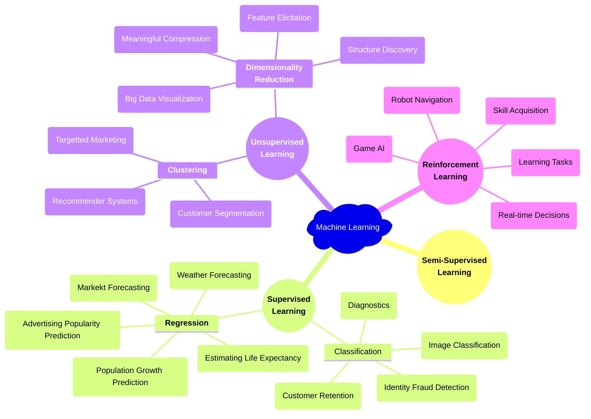
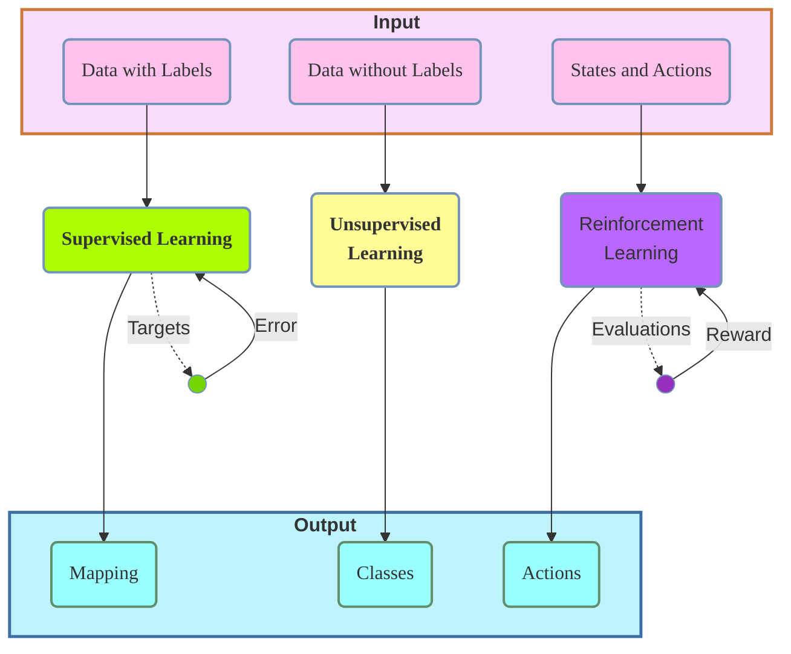
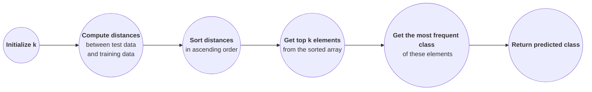

**Acknowledgement:** This post is based mainly on Dr. Vinh-Dinh Nguyen's presentation and slides and partly on on TA, STA, and peers' responses from the course AIO2025 offered by AI VIETNAM.

**Relevance:** The audience of this lecture were those who have read [Machine Learning 101 Warm-up](), had some coding experience, and known a bit of AI knowledge. 2025-08-05-KNN-pre101

In today's post, we'll explore KNN and Supervised Learning. We'll also discuss some applications in AI including a text classification problem and a medical case study.

<hr>

## **Machine Learning**
**Machine Learning (ML)** is a subfield of *Artificial Intelligence (AI)*, referring to learning the best approximation of a function from the training data so that data can be predicted accurately.

<figcaption style='text-align: center; width: 100%; font-size: 0.875em; margin-top:-5px; margin-bottom:15px;'>
    <em>Figure 1.</em> Machine Learning Overview
</figcaption>

There are four main types of **ML**:
- **Supervised Learning (SL):** learning *with guidance---from a labeled dataset* to map features to a potentially correct label.
    - Examples: predicting the shape of a geometric object after learning a labeled dataset and predicting the linear relationship between features and label.
- **Unsupervised Learning (USL):** learning *without explicit guidance or labeled data* to stamp labels for data points.
    - Examples: labeling a dataset of animal images.
- **Semi-Supervised Learning (SSL):** a combination of SL and USL.
- **Reinforcement Learning (RL):** learning via interactions with external environments and *evaluation-reward-punishment process* to maximize the cumulative reward. This is a *trial-and-error approach* where agents, just like a human, learn from feedback and adjust its actions until getting a desired outcome. 
    - Examples: autonomous vehicles or chess playing.


<figcaption style='text-align: center; width: 100%; font-size: 0.875em; margin-top:-5px; margin-bottom:15px;'>
    <em>Figure 2.</em> Machine Learning Procedure Overview
</figcaption>

### **Approaches**
There are several appproaches for a ML problem.
- **Parametric Approach:** This is a classic SL. We try to parametrize the function, so we need to go through some important steps.
    - Identify if the function is linear or non-linear.
    - Identify the parameters for a linear function/regression.
- **Eager Learning Approach:** We build and train a model/function based on the entire training dataset before the prediction phase starts. 
    - Spend a long time learning and building the function. 
    - Spend less time classifying or inferring the function.
- **Model-based Learning Approach:** We build a model that captures parttern in the data.
    - Spend a long time learning and building the function. 
    - Spend less time classifying or inferring the function.

Eager and model-based learning methods can be both parametric and non-parametric.

<hr>

## **$K$-Nearest Neighbors (KNN) Overview**
The parametric approach *technically* involves the assumptions of having/looking for a fixed number of parameters regardless of dataset size. This means the method *strongly relies on* the assumptions about the data. which could lead to poor performance if the assumptions are incorrect. This is where KNN comes in as a *non-parametric approach*.

### **Motivation**
**KNN** is an algorithm where 
- there is **no assumptions** made about underlying data distribution.
- **learning takes less time** and **testing takes more time**.
    - a training dataset is *stored without learning* a function or building a model *during the training phase*.
    - *predictions* are made on data *only when* KNN actually *receives test data*.

These properties are the reasons for **KNN** to be called **lazy learning** or **instance-based learning**. You can think of it as a lazy student partaking in an exam with no studying or revising in advance.

A typical example is a given image dataset of different kinds of insects and animals with known categories. If we are given a covered image with its intensity matrix and need to predict which group it belongs to, KNN will look for its $K$ nearest neighbors from the dataset to choose a potentially correct category. "Nearest" refers to the closet distance.

### **Procedure**
:pushpin: **Note:** The value of $K$ can completely change your model’s prediction. That's because KNN picks the category by majority vote among the $K$ closet neighbors. Thus, *choosing the optimal $K$* plays a critical role in KNN. 

We should always preprocess the data befor running KNN. Once ready, the algorithm follows a simple flow:
1. *Initialize* the value of $K$.
2. *Compute the **similar feature**/distance* between test point and all data points (every row of the training dataset).
3. *Sort* the calculated distances in ascending order. 
4. *Select top $K$ elements* from the sorted array.
5. *Vote the most frequent label* of these elements.
6. *Predict*---return the predicted class.


<figcaption style='text-align: center; width: 100%; font-size: 0.875em; margin-top:-5px; margin-bottom:15px;'>
    <em>Figure 3.</em> KNN Procedure
</figcaption>

In step 5, we may run into a situation where two or more labels appear equally often. This occurs especially when $K$ is even. We'll explore strategies to handle this later. 

For step 2, there is *no* generic formula for choosing a **metric**. A good practice is to understand the pros and cons of each metric to decide if it is suitable for the dataset. Also, we can experiment them to see which metric gives the most consistent and meaningful results for the dataset. Common **metrics** to compute the similarity between features are 
- cosine similarity 
- correlation coefficient
- L1 (absolute value)
- L2 (Euclidean distance)
- Hamming distance
- Manhattan distance
- Minkowski distance
- Chebyshev distance
- Jaccard distance
- Haversine formula
- Sørensen–Dice coefficient.

~~DEMONSTRATION FOR METRIC from slides maybe~~

We can use an available package for KNN with its default metric being Minkowski distance.

```python
# call the package with initialized K
# specify which metric via p, p=2 indicated Euclidean distance
knn = KNeighborsClassifier(n_neighbors=K, p=2)

# save and arrange dataset
knn.fit(X_train, y_train)

# make predictions
pred = knn.predict(X_test)
```

## **Selecting $K$ in KNN**
As mentioned earlier, different $K$ may give different results. Thus, it's imperative we choose $K$ that provides the best approximated outcome. One approach is by trial and error---figuring out the value of $K$ holding the highest accuracy after the training process.  

:question: This boils down to the question, **How can we evaluate a model's performance based on the choice of $K$?**

We can use the following ready-to-use package for this purpose.

```python
from sklearn.metrics import accuracy_score, classification_report

# compute the accuracy percentage
accuracy_score(y_test, y_pred)

# compute the set of precision, recall, and f1-score
classification_report(y_test, y_pred)
```

### **Evaluating a Model's Performance**

In practice, we use the values of **precision**, **recall**, and **F1-score** to assess a model's performance. This is because the (naive) accuracy is *not* a reliable metric to evaluate a model's performance. A very high accuracy may lead to a behavior called **overfitting**. See the analysis below.

<details class = "bordered-block">
    <summary>
        <strong>Error Analysis</strong>
    </summary>
    <div class = "bordered-inner-block language-python">
        <strong>Problem statement:</strong> Cancer classification of $10000$ patients: Only $0.5\%$ of patients in the test set have cancer and a logistic regresssion model gives $99\%$ accuracy.
        <br>
        <strong>Breakdown:</strong> 
        <ul>
            <li> $P$ is the number of correctly predicted cases. </li>
        </ul> 
        <strong>Idea:</strong> We check the accuracy percentage of two models: the logistic regression and a simple algorithm always predicts "No Cancer". 
        <table class = "language-python">
            <tr>
                <th></th>
                <th>Logistic Regression</th>
                <th>Always-Predict-No-Cancer Algorithm</th>
            </tr>
            <tr>
                <th scope='row'>Accuracy Values</th>
                <td>
                    $P = 99\%$ <br>
                    $9900$ patients are correctly predicted.
                </td>
                <td>
                    $P = 100 - 0.05 = 99.5\%$ <br>
                    $9950$ patients are correctly predicted with no cancer.
                </td>
            </tr>
            <tr>
                <th scope='row'>Pros and Cons</th>
                <td>Obtain lower accuracy but it possibly catches bothe cancer and no-cancer cases.</td>
                <td>Look "perfect" by accuracy but it never catches a single cancer case.</td>
            </tr>
            <tr>
                <th scope='row'>Note</th>
                <td colspan="2">CANNOT conclude the model with higher (naive) acccuracy is better.</td>
            </tr>
        </table>
    </div>
</details>
<br>

**Precision** is the ratio of all the model's positive predictions that are actually positive. In the example above, it is the fraction between correctly predicted cancer cases and all the predicted cancer cases.

**Recall** is the proportion of all the actual positive cases that are correctly predicted positive. In this example, it is the percentage of correctly predicted cancer cases over all the real cancer cases.

**$F_1$ score** is a metric that combines both precision and recall into a single number using the **harmonic mean**. This mean penalizes the imbalance of a dataset like the simple algorithm example earlier. That is, *$F_1$ score* will *only* be high if *both precision and recall are high*. We use *$F_1$ score* to *evaluate a model's performance* since it delivers a single quantitative measure that balances precision and recall. 

<table>
    <tr>
        <th colspan='2' rowspan='2'>Dataset</th>
        <th colspan='2'>Real Label</th>
        <th rowspan='2'>Note</th>
    </tr>
    <tr>
        <th>Positive</th>
        <th>Negative</th>
    </tr>
    <tr>
        <th scope='row' rowspan='2'>Predicted Label</th>
        <th scope='row'>Positive</th>
        <td>True Positive $TP$</td>
        <td>False Positive $FP$</td>
        <td>$$\text{Precision} = \frac{TP}{TP + FP}$$</td>
    </tr>
    <tr>
        <th scope='row'>Negative</th>
        <td>False Negative $FN$</td>
        <td>True Negative $TN$</td>
        <td></td>
    </tr>
    <tr>
        <th scop='row' colspan='2'>Note</th>
        <td>$$\text{Recall} = \frac{TP}{TP + FN}$$</td>
        <td></td>
        <td>
        $$\begin{align*}
        &F_1 \text{ Score} \\ &= 2 \times \frac{\text{Precision } \times \text{ Recall}}{\text{Precision } + \text{ Recall}}
        \end{align*}$$
        </td>
    </tr>
</table>
<br>

The following table illustrates the kind of problem we may encounter if we only make guesses from precision and recall values. We can choose the algorithm with *higher $F_1$ score* for a *better model performance*. 

<table>
    <tr>
        <th></th>
        <th>Precision (P)</th>
        <th>Recall (R)</th>
        <th>Issue</th>
        <th>$F_1$ Score</th>
    </tr>
    <tr>
        <th scope='row'>Algorithm 1</th>
        <td>$0.5$</td>
        <td>$0.4$</td>
        <td>$0.5$ says only half of the people flagged as cancer patients truly have cancer and the model predict $40\%$ cancer cases correctly. <br>
        This suggests that the model may do too much guess work rather than logical prediction and give mediocre overall.</td>
        <td>$0.444$</td>
    </tr>
    <tr>
        <th scope='row'>Algorithm 2</th>
        <td>$0.7$</td>
        <td>$0.1$</td>
        <td>$0.7$ means $70\%$ of predicted cancer cases actually have cancer but the model misses $90\%$ of people who really have cancer. <br>
        This suggests that the model may be too careful when identify cancer cases, meaning it flags excessive number of non-cancer patients.</td>
        <td>$0.175$</td>
    </tr>
    <tr>
        <th scope='row'>Algorithm 3</th>
        <td>$0.02$</td>
        <td>$1$</td>
        <td>$1$ means the model can catch every single cancer patient but out of all the people it flags as having cancer, $98\%$ are actually healthy. <br>
        This suggests that the model may predict all the patients have cancer, which produces many false alarms.</td>
        <td>$0.039$</td>
    </tr>
</table>
<br>

### **Weight in KNN**
In the previous section, we mentioned the issue with the classic KNN algorithm where a tie in voting happens at step 5, especially $K$ is even. In this case, there is no specific instruction on which label should be chosen as two of them are both most frequent.



To address this problem, **scikit-learn** allows us to provide some additional parameter to control how ties are resolved in the case of some labels making an **equal contribution** among the $K$ nearest neighbors. This is to stress on each label's **amount of say**---its influence compared to others. 

The addition parameter discussed here is `weights` in `classifier = KNeighborsClassifier(n_neighbors=8, weights = 'WeightType')`. Common weight types are
- **uniform**: default weights.
- **distance**
    - Closer neighbors have more influence than farther ones.
    - Weight is typically inverse of distance, that is, $\sum \frac{1}{d}$ where d is the distance from the test point to a training point.
- **User-defined**.


<details class = "bordered-block">
    <summary>
        <strong>Practice Exercises</strong>
    </summary>
    <div class = "bordered-inner-block language-python">
        <strong>Exercise 1:</strong> Write a function to compute Euclidean distance between two data points (vectors) using a <code>for</code> loop. 
        <br>
        <strong>Exercise 2:</strong> Do the same as exercise 1 for $x\_test = (2.4, 0.8)$ and $x\_test = (2.6, 0.8)$ when
        <ol>
            <li> $k = 1$ </li>
            <li> $k = 3$ </li>
            <li> $k = 5$ </li>
        </ol>
        
        <strong>Exercise 3:</strong> Write code for both exercises above.
        <br>
        <strong>Exercise 4:</strong> Use the following table and step-by-step procedure with Euclidean distance to predict the salary for $experience = 5.3$ when
        <ol>
            <li> $k = 2$ </li>
            <li> $k = 3$ </li>
            <li> $k = 4$ </li>
        </ol>
        
        <strong>Exercise 5:</strong> Write code for exercise 4 above.
    </div>
</details>
<br>

<hr>


<figure>
    <div style='display: flex; flex-wrap:wrap; column-gap: 20px; justify-content: center'>
        {% include figure.liquid loading="eager" path="assets\aio2025\M03W02\tuesday_knn_exercise_procedure_2features.png" class="img-fluid rounded z-depth-1 mx-auto d-block" zoomable=true max-width="300px" max-height="300px" alt="petal length values are much greater than petal width, increasing the distances along with them, so the distances increase according to and are determined by length" caption="Petal length values are much greater than petal width. So, the distances increase according to and are determined more by length." %}
        
    </div>
    <figcaption style="text-align: center; width: 100%; font-size:0.875em; margin-top:-25px;">
        <em>Figure 1.</em> Examples of issue without scaling
    </figcaption>
</figure>


## **KNN for Classification Tasks**
<details class = "bordered-block">
    <summary>
        <strong>Text Classification with KNN</strong>
    </summary>
    <div class = "bordered-inner-block language-python">
        <strong>Problem statement:</strong> Solve the task of text classification using KNN with the given procedure. 
        <br>
        <strong>Breakdown:</strong> 
        <ul>
            <li> Input is a corpus of texts or strings and a random string that is not in the corpus. </li>
            <li> Output is a corpus string that is potentially closet to the random string. </li>
        </ul> 
        <strong>Idea:</strong> We follow the procedure of the KNN algorithm.
        <ol>
            <li> To build a model, we follow a <strong>pipeline</strong> which is a complete model building process. </li>
                <ol>
                    <li> <em>Obtain message input</em> with its label values. </li>
                    <li> <em>Preprocessing: convert</em> message to numeric values like vectors. </li>
                    <li> <em>Build vocabulary</em>. </li>
                    <li> <em>Create features</em>. </li>
                    <li> <em>Pass to a KNN model</em>. </li>
                    <li> <em>Obtain results</em>. </li>
                </ol>
            <li> We can handle preprocessing to build vocabulary via two approaches: <strong>Bag-of-Words (BoW)</strong> and <strong>Term Frequency-Inverse Document Frequency (TF-IDF)</strong>. </li>
        </ol>
        :pushpin: <strong>Note:</strong> Essentially, the KNN algorithm stays similar for all types of data: image, sound, tabular, and time series data. But we need to figure out how to work with given data to induce real feature values.
    </div>
</details>
<br>
*BoW* is simpler and more basic approach to text representation than *TF-IDF*. BoW only considers word occurences while TF-IDF provides more *informative* representation of text---taking into account both word importance and context within the entire dataset. *TF-IDF is generally preferred*. We'll delve deeper into the two techniques right away.

<details class = "bordered-block">
    <summary>
        <strong>Bag-of-Words (BoW)</strong>
    </summary>
    <div class = "bordered-inner-block language-python">
        <strong>Problem statement:</strong> We have the following corpus.  
        <table class = "language-python">
            <tr>
                <th>Doc</th>
                <th>Label</th>
            </tr>
            <tr>
                <td>you reap what you sow</td>
                <td class = "centered_td">1</td>
            </tr>
            <tr>
                <td>beggars can't be choosers</td>
                <td class = "centered_td">1</td>
            </tr>
            <tr>
                <td>like bees to honey</td>
                <td class = "centered_td">1</td>
            </tr>
            <tr>
                <td>bite the hands that feed you</td>
                <td class = "centered_td">0</td>
            </tr>
            <tr>
                <td>a taste of your own medicine</td>
                <td class = "centered_td">0</td>
            </tr>
            <tr>
                <td>burn your bridges behind you</td>
                <td class = "centered_td">0</td>
            </tr>
        </table>
        <br> 
        <strong>Idea:</strong> BoW is to investigate distances between two sentences based on word occurences.
        <ol>
            <li> <strong>Tokenization</strong> splits text into a list of smaller parts or separate words. </li>
            <li> Initialize an empty vocabulary. Add new words from tokenized corpus into the vocabulary. </li>
            Vocabulary = 
            <li> Take a random string: <em>"you can't pick and choose"</em>. </li>
            <li> Convert the string to a numeric value by creating a <strong>BoW</strong> from the string and assigning a number to each of them. Two common ways are </li>
                <ul>
                    <li> <strong>Binary BoW:</strong> Words in the string are assigned $1$ and others are $0$. </li>
                    <li> <strong>(Complete) BoW:</strong> Each value is the number of its' word <em>occurrency</em>. </li>
                </ul>
            We use the <em>(complete) BoW</em> for this problem.   
                <ul>
                    <li> From here, we build a matrix where each row is a word in the constructed vocabulary, each column is a sentence from the corpus, and each cell of a column is the BoW value of the corresponding sentence. Corpus sentences now become <em>training vectors/points</em>. </li>
                    <li> With the random string, we can build a <em>test vector/point</em>. </li>
                </ul>
                <s>DEMONSTRATION for matrix</s>
        </ol>
        <br>
        
    </div>
</details>

<details class = "bordered-block">
    <summary>
        <strong>Term Frequency-Inverse Document Frequency (TF-IDF)</strong>
    </summary>
    <div class = "bordered-inner-block language-python">
        <strong>Problem statement:</strong> We use the same corpus as in BoW. We can also use this approach to do spam email detection.
        <br>
        <strong>Breakdown:</strong> 
        <ul>
            <li> A document is a sentence/ an email. </li>
            <li> The corpus is a collection of documents. </li>
        </ul> 
        <strong>Idea:</strong> TF-IDF is to compute the importance level of a word or phrase relative to its parent sentence/email and the entire corpus. Thus, TF-IDF helps identify words that are significant in a specific document but maybe rare across all the documents.
        <ol>
            <li> We build the same matrix for the entire corpus as in Bag-of-Words technique. </li>
            <li> We build three other matrices: </li>
                <ul>
                    <li> <strong>TF matrix:</strong> Each cell is the corresponding TF value of the row word and the column document. </li>
                    <li> <strong>IDF matrix:</strong> Each cell is the corresponding IDF value of the row word and the column document. </li>
                    <li> <strong>TF-IDF matrix:</strong> Each cell is the corresponding TF-IDF value of the row word and the column document. </li>
                    <li> <strong>Normalized TF-IDF matrix:</strong> Each cell is the corresponding normalized TF-IDF value of the row word and the column document. </li>
                </ul>
            <li> We build vectors for test documents. </li>
            <li> <strong>Term Frequency (TF)</strong> measures how often a term/word appears in a document, that is how important a word is in a document. </li>
                $$\begin{align*}
                TF_{(t,d)} &= count(t,d) \\ &= \frac{\text{Number of times word$_\textbf{i}$ appears in a document}}{\text{Total number of words in the document}}
                \end{align*}$$
                or <em>in practice</em>,
                $$TF_{(t,d)} = \log{(count(t,d) + 1)}$$
            However, a word with a high occurence may not actually be of large importance, for example "the", "and", "are", and "is". We need additional step to handle this situation. 
            <li> <strong>Inverse Document Frequency (IDF)</strong> measures how important a word is across the entire corpus. </li>
                $$\begin{align*}
                IDF_{t} &= \log \frac{\text{Total number of documents}}{\text{Number of documents containing word$_\textbf{i}$}} \\ &= \frac{N}{DF_t}
                \end{align*}$$
                or <em>in practice</em>,
                $$\begin{align*}
                IDF_{t} &= \log \frac{\text{Total number of documents + 1}}{\text{Number of documents containing word$_\textbf{i}$ + 1}} + 1 \\ &= \frac{N + 1}{DF_t + 1} + 1
                \end{align*}$$
            Adding $1$ is to avoid $0$ as a result since it could kill of the importance of a word and avoid division by zero. This technique is called <strong>smoothing</strong> used in packages like <strong>scikit-learn</strong>.
            <li> <strong>TF-IDF</strong> computes the importance of a word in an email relative to the entire collection. </li>
                $$TF-IDF_{(t,d)} = TF_{(t,d)} \times IDF_{t}$$
            This multiplication helps compensate for the disproportionate influence of frequently occuring but uninformative words and ensure the more meaningful features contribute appropriately to the distance calculations. <br>
            This next step is not required. The TF-IDF matrix contains many zeros and possiblly much greater values, so we need to normalize them like we perform scaling in KNN. This helps avoid bias from document length.
            <li> <strong>Normalized TF-IDF</strong> takes the unit vector of each TF-IDF vector. <strong>L2 norm</strong> is also known as <strong>Euclidean norm</strong>. </li>
                $$L2\_norm(TF-IDF) = \frac{TF-IDF}{\left \| TF-IDF \right \|_2} = \frac{\langle x_1, \cdots, x_n}{\left( \sum_i=1^n x_i^2\right)^\frac{1}{2}}$$
                <s>DEMONSTRATION for matrix</s>
        </ol>
        
    </div>
</details>

<details class = "bordered-block">
    <summary>
        <strong>Practice Exercises</strong>
    </summary>
    <div class = "bordered-inner-block language-python">
        <strong>Exercise 1:</strong> Given a corpus of two documents: doc 1 = "apple banana" and doc 2 = "banana banana". Compute TF, IDF, and TF-IDF (both theoretical and practical).
        <br>
        <strong>Exercise 2:</strong> Write code to complete the example for each approach.
    </div>
</details>

<hr>

## **Case Study: Code Implementation**
We primarily use the **scikit-learn** library for ML problems. 

**Problem statement:** *Build a system to predict whether a tumor is maglinant or benign based on real-valued information using KNN.*

**Set Up** 

```python
# for a tabular dataset
import pandas as pd

# this dataset is available in the package, so we just need to import it
from sklearn.datasets import load_breast_cancer

# 
from sklearn.model_selection import train_test_split

# for scaling data (mentioned above)
from sklearn.preprocessing import StandardScaler

# KNN algorithm in the package
from sklearn.neighbors import KNeighborsClassifier

# for classification tasks and assessing how accurate our model is
from sklearn.metrics import accuracy_score, classification_report
```

The **pipeline** for a ML problem follows the basic procedure below. In practice, there can more steps to work through. 
1. Data input
2. Data preprocessing
3. Data spliting:
    - Training data
    - Test data
4. Data training
5. Model evaluation

**Data Input**

```python
# load and read the dataset
cancer = load_breast_cancer()

# convert the feature columns to a DataFrame
X = pd.DataFrame(cancer.data, columns=cancer.feature_names)

# convert the label column to a Series
y = pd.Series(cancer.target, name='target')
```

~~DEMONSTRATION FOR FIRST FIVE ROWS~~

Since the target contains non-numerical values: benign and malignant, we need to assign numeric values to them: $1$ for benign and $0$ for malignant.

**Data Spliting** <br>
We mentioned splitting a dataset (label included) into two sets: training and test data. But in practice, a dataset is usally divided into three following sets:
- Training data
- Test data
- *Evaluation data:* we use this set to evaluate how accurate the ML model is---checking how close its predicted label values is to its actual label values, then check the same for test data.

```python
val_size = 0.2
test_size = 0.125
random_state = 0
is_shuffle = True

# split training and test data
X_train, X_test, y_train, y_test = train_test_split(
    X, y, 
    test_size=test_size, 
    shuffle=is_shuffle,
    random_state=random_state)

# split training and evaluation data
X_train, X_val, y_train, y_val = train_test_split(
    X, y, 
    test_size=val_size, 
    shuffle=is_shuffle,
    random_state=random_state)
```

**Data Training** <br>

```python
# scale data
# call scaling function
scaler = StandardScaler()

# scale both training and test data
X_train_scaled = scaler.fit_transform(X_train)
X_test_scaled = scaler.transform(X_test)
```

```python 
# initialize k
k = 5

# call KNN algorithm
knn_classifier = KNeighborsClassifier(n_neighbors=k)

# train data
knn_classifier.fit(X_train_scaled, y_train)
```

~~DEMONSTRATION IN SLIDE, ONLY TAKE 2 FOR VISUALIZATION, SHOULD BE 30 BUT THERE IS NO WAY TO VISUALIZE 30 DIMENSIONS~~

**Model Evaluation** <br>
This step plays a very important role during the model development. Depending on the result, we can tune parameters, try different metrics, process the data differently or other methods. Once we get high-enough accuracy, we can start testing on test data. 

You can think of evaluation data as a practice exam while test data is a real exam.

```python
# make evaluation on evaluation data

# test on evaluation data
y_pred = model.predict(X_val_scaled)

# check the model's accuracy on evaluation data
accuracy = accuracy_score(y_val, y_pred)

# obtain precision, recall, and f1-score values
report = classification_report(y_val, y_pred)
```

```python
# make evaluation on test data

# test on test data
y_pred = model.predict(X_test_scaled)

# check the model's accuracy on test data
accuracy = accuracy_score(y_test, y_pred)

# obtain precision, recall, and f1-score values
report = classification_report(y_test, y_pred)
```

We can write our own code for checking the accuracy above using the formula  

$$Accuracy = \frac{\text{Numer of correct predictions}}{\text{Total numebr of predictions}}.$$

The same goes for *precision*, *recall*, and *F1-Score* values.

<details class = "bordered-block">
    <summary>
        <strong>Practice Exercises</strong>
    </summary>
    <div class = "bordered-inner-block language-python">
        <strong>Exercise 1:</strong> Write code to display the first five rows, data information, statistics information, numeric value assignments, 
        <br>
        <strong>Exercise 2:</strong> What are the accuracy scores for evaluation and test data?
    </div>
</details>

<hr>

## :speech_balloon: **FAQ**
Here are some good questions asked during class. The answers to these questions came from either some admin, TA, STA, or members of AIO2025.

| Questions | Answers |
|-----------|---------|
|  |  |
|  |  |
|  |  |
|  |  |
|  |  |
|  |  |
|  |  |

<br>

<!-- #### Check List

- [x] Exercise 1 (date)
- [ ] Exercise 2 (date)
  - [x] Put on left sock
  - [ ] Put on right sock
- [x] Go to school -->
